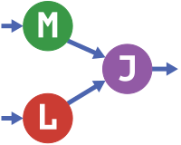

# MLJTutorial.jl

Tutorials for introducing the machine learning toolbox
[MLJ](https://alan-turing-institute.github.io/MLJ.jl/dev/) (Machine
Learning in Julia) 

<div align="center">
	
</div>

Based on tutorials originally part of a 3.5 hour [online
workshop](https://github.com/ablaom/MachineLearningInJulia2020).


## The tutorials are [here](https://ablaom.github.io/MLJTutorial.jl/dev/).


### Legacy Pluto notebooks

Pluto notebooks, adapted from the original julia scripts by @roland-KA, are available
[here](pluto_notebooks). These are not synchronized with the julia (and markdown) scripts
and include some outdated API, especially in Tutorial 5.

### For maintainers

The tutorials are embedded in Documenter.jl documentation, and live at
[/docs/src/notebooks/](/docs/src/notebooks/). **The ground truth for content is the julia
scripts,** which must follow the
[Literate.jl](https://duckduckgo.com/?q=Literate.jl&t=osx&ia=web) rules for embedding the
narrative as code comments. 

Package management is through a workspace tree with the root Project.toml as stump. Each
notebook getting its own Project.toml file in the workspace tree. The julia version is
specified in the root Project.toml. There are no committed manifests, only project files
with [compat] lower bounds.

After making changes to a julia script or any Project.toml file, post a pull request and
CI will automatically generate new markdown (using Literate.jl), inviting you to review a
new pull request committing the changes.

In more detail, to amend a tutorial:

1. Edit the julia script for that tutorial and check it executes using an instantiated
   package environment based on the Project.toml in the same folder.
2. Optionally, test markdown generation for that tutorial (see below) but do not commit any
   new markdown you generate.
3. Post a pull request.
4. Follow the instructions that should appear in the pull request conversation, after CI
   concludes.

If you add a new tutorial, you will need to:

- Add it to to the [workspace] in "docs/Project.toml"
- Add an entry to the `pages` section of "docs/make.jl"
- Add it to the table of contents at "docs/src/index.md"


#### Testing markdown generation

To test markdown generation locally, change to the root directory of your local
MLJTutorial.jl clone, check the root Project.toml is properly resolved, and run this in
julia:

```julia
using Pkg
Pkg.activate("NotebookManagementTools")
using NotebookManagementTools
generate(joinpath("docs", "src", "notebooks", "02_models"))
```

but change "02_models" to the tutorial you are testing. If you are adding a brand new
tutorial, *do commit* the generated markdown, but for updates this is discouraged.
