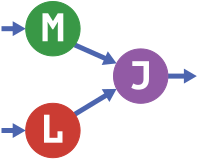

# MLJTutorial.jl

UNDER CONSTRUCTION

Notebooks for introducing the machine learning toolbox
[MLJ](https://alan-turing-institute.github.io/MLJ.jl/dev/) (Machine
Learning in Julia) 

	

Based on tutorials originally part of a 3.5 hour [online
workshop](https://github.com/ablaom/MachineLearningInJulia2020).

#### [Options for running the tutorials](options.md)

### Prerequisites

- Familiarity with basic data manipulation in Julia: vectors, tuples,
  dictionaries, arrays, generating random numbers, tabular data (e.g.,
  DataDrames.jl) basic stats, Distributions.jl.

- Familiarity with Machine Learning fundamentals
  ([disclaimer](#more-about-the-tutorials)).

### Topics covered

#### Basic

- Part 1 - **Data Representation**

- Part 2 - **Selecting, Training and Evaluating Models**

- Part 3 - **Transformers and Pipelines**

#### Advanced

- Part 4 - **Tuning hyper-parameters**

- Part 5 - **Advanced model composition** 

The tutorials include links to external resources and exercises with
solutions.

### More about the tutorials 

- The tutorials focus on the *machine learning* part of the data
  science workflow, and less on exploratory data analysis and other
  conventional "data analytics" methodology

- Here "machine learning" is meant in a broad sense, and is not
  restricted to so-called *deep learning* (neural networks)

- The tutorials are crafted to rapidly familiarize the user with what
  MLJ can do and how to do it, and are not a substitute for a course
  on machine learning fundamentals. Examples do not necessarily
  represent best practice or the best solution to a problem.

### Additional resources

- [MLJ Cheatsheet](https://alan-turing-institute.github.io/MLJ.jl/dev/mlj_cheatsheet/)
- [Common MLJ Workflows](https://alan-turing-institute.github.io/MLJ.jl/dev/common_mlj_workflows/)
- [MLJ manual](https://alan-turing-institute.github.io/MLJ.jl/dev/)
- [Data Science Tutorials in Julia](https://juliaai.github.io/DataScienceTutorials.jl/)

