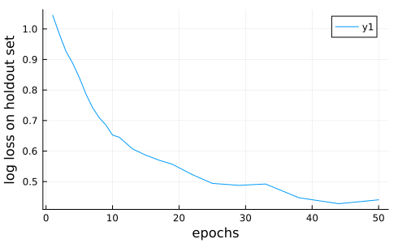

```@meta
EditURL = "notebook.jl"
```

# Tutorial 2. Selecting, Training and Evaluating Models

> **Goals:**
> 1. Search MLJ's database of model metadata to identify model candidates for a supervised learning task.
> 2. Evaluate the performance of a model on a holdout set using basic `fit!`/`predict` workflow.
> 3. Inspect the outcomes of training and save these to a file.
> 4. Evaluate performance using other resampling strategies, such as cross-validation, in one line, using `evaluate!`
> 5. Plot a "learning curve", to inspect performance as a function of some model hyperparameter, such as an iteration parameter

To run the code in this tutorial in a live Julia session, first follow the instructions
given [here](@ref instructions).

The "Hello World!" of machine learning is classification of iris flowers using a famous
[dataset](https://en.wikipedia.org/wiki/Iris_flower_data_set) of Ronald Fisher. This
time, we'll grab the data from [OpenML](https://www.openml.org):

````@julia
using MLJ
iris = OpenML.load(61); # a column dictionary table
````

To describe the dataset, with no need to load it first, run
`OpenML.describe_dataset(61)`.

````@julia
import DataFrames
iris = DataFrames.DataFrame(iris);
first(iris, 4)
````

```@raw html
<div><div style = "float: left;"><span>4×5 DataFrame</span></div><div style = "clear: both;"></div></div><div class = "data-frame" style = "overflow-x: scroll;"><table class = "data-frame" style = "margin-bottom: 6px;"><thead><tr class = "columnLabelRow"><th class = "stubheadLabel" style = "font-weight: bold; text-align: right;">Row</th><th style = "text-align: left;">sepallength</th><th style = "text-align: left;">sepalwidth</th><th style = "text-align: left;">petallength</th><th style = "text-align: left;">petalwidth</th><th style = "text-align: left;">class</th></tr><tr class = "columnLabelRow"><th class = "stubheadLabel" style = "font-weight: bold; text-align: right;"></th><th title = "Float64" style = "text-align: left;">Float64</th><th title = "Float64" style = "text-align: left;">Float64</th><th title = "Float64" style = "text-align: left;">Float64</th><th title = "Float64" style = "text-align: left;">Float64</th><th title = "CategoricalArrays.CategoricalValue{String, UInt32}" style = "text-align: left;">Cat…</th></tr></thead><tbody><tr class = "dataRow"><td class = "rowLabel" style = "font-weight: bold; text-align: right;">1</td><td style = "text-align: right;">5.1</td><td style = "text-align: right;">3.5</td><td style = "text-align: right;">1.4</td><td style = "text-align: right;">0.2</td><td style = "text-align: left;">Iris-setosa</td></tr><tr class = "dataRow"><td class = "rowLabel" style = "font-weight: bold; text-align: right;">2</td><td style = "text-align: right;">4.9</td><td style = "text-align: right;">3.0</td><td style = "text-align: right;">1.4</td><td style = "text-align: right;">0.2</td><td style = "text-align: left;">Iris-setosa</td></tr><tr class = "dataRow"><td class = "rowLabel" style = "font-weight: bold; text-align: right;">3</td><td style = "text-align: right;">4.7</td><td style = "text-align: right;">3.2</td><td style = "text-align: right;">1.3</td><td style = "text-align: right;">0.2</td><td style = "text-align: left;">Iris-setosa</td></tr><tr class = "dataRow"><td class = "rowLabel" style = "font-weight: bold; text-align: right;">4</td><td style = "text-align: right;">4.6</td><td style = "text-align: right;">3.1</td><td style = "text-align: right;">1.5</td><td style = "text-align: right;">0.2</td><td style = "text-align: left;">Iris-setosa</td></tr></tbody></table></div>
```

**Main goal:** To build and evaluate models for predicting the
`:class` variable, given the four remaining measurement variables.

### Step 1. Inspect and fix scientific types

````@julia
schema(iris)
````

````
┌─────────────┬───────────────┬──────────────────────────────────┐
│ names       │ scitypes      │ types                            │
├─────────────┼───────────────┼──────────────────────────────────┤
│ sepallength │ Continuous    │ Float64                          │
│ sepalwidth  │ Continuous    │ Float64                          │
│ petallength │ Continuous    │ Float64                          │
│ petalwidth  │ Continuous    │ Float64                          │
│ class       │ Multiclass{3} │ CategoricalValue{String, UInt32} │
└─────────────┴───────────────┴──────────────────────────────────┘

````

These look fine.

### Step 2. Split data into input and target parts

Here's how we split the data into target and input features, which
is needed for MLJ supervised models. We can randomize the data at
the same time:

````@julia
y, X = unpack(iris, ==(:class), rng=123);
scitype(y)
````

````
AbstractVector{Multiclass{3}} (alias for AbstractArray{ScientificTypesBase.Multiclass{3}, 1})
````

This puts the `:class` column into a vector `y`, and all remaining
columns into a table `X`.

To see the documentation for this function, type `?unpack` in the Julia REPL (or use
`@doc unpack` elsewhere).

### On searching for a model

Here's how to see *all* models (not immediately useful):

````@julia
all_models = models()
````

````
239-element Vector{NamedTuple{(:name, :package_name, :is_supervised, :abstract_type, :constructor, :deep_properties, :docstring, :fit_data_scitype, :human_name, :hyperparameter_ranges, :hyperparameter_types, :hyperparameters, :implemented_methods, :inverse_transform_scitype, :is_pure_julia, :is_wrapper, :iteration_parameter, :load_path, :package_license, :package_url, :package_uuid, :predict_scitype, :prediction_type, :reporting_operations, :reports_feature_importances, :supports_class_weights, :supports_online, :supports_training_losses, :supports_weights, :tags, :target_in_fit, :transform_scitype, :input_scitype, :target_scitype, :output_scitype)}}:
 (name = ABODDetector, package_name = OutlierDetectionNeighbors, ... )
 (name = ABODDetector, package_name = OutlierDetectionPython, ... )
 (name = ARDRegressor, package_name = MLJScikitLearnInterface, ... )
 (name = AdaBoostClassifier, package_name = MLJScikitLearnInterface, ... )
 (name = AdaBoostRegressor, package_name = MLJScikitLearnInterface, ... )
 (name = AdaBoostStumpClassifier, package_name = DecisionTree, ... )
 (name = AffinityPropagation, package_name = Clustering, ... )
 (name = AffinityPropagation, package_name = MLJScikitLearnInterface, ... )
 (name = AgglomerativeClustering, package_name = MLJScikitLearnInterface, ... )
 (name = AutoEncoder, package_name = BetaML, ... )
 (name = BM25Transformer, package_name = MLJText, ... )
 (name = BaggingClassifier, package_name = MLJScikitLearnInterface, ... )
 (name = BaggingRegressor, package_name = MLJScikitLearnInterface, ... )
 (name = BayesianLDA, package_name = MLJScikitLearnInterface, ... )
 (name = BayesianLDA, package_name = MultivariateStats, ... )
 (name = BayesianQDA, package_name = MLJScikitLearnInterface, ... )
 (name = BayesianRidgeRegressor, package_name = MLJScikitLearnInterface, ... )
 (name = BayesianSubspaceLDA, package_name = MultivariateStats, ... )
 (name = BernoulliNBClassifier, package_name = MLJScikitLearnInterface, ... )
 (name = Birch, package_name = MLJScikitLearnInterface, ... )
 (name = BisectingKMeans, package_name = MLJScikitLearnInterface, ... )
 (name = BorderlineSMOTE1, package_name = Imbalance, ... )
 (name = CBLOFDetector, package_name = OutlierDetectionPython, ... )
 (name = CDDetector, package_name = OutlierDetectionPython, ... )
 (name = COFDetector, package_name = OutlierDetectionNeighbors, ... )
 (name = COFDetector, package_name = OutlierDetectionPython, ... )
 (name = COPODDetector, package_name = OutlierDetectionPython, ... )
 (name = CardinalityReducer, package_name = MLJTransforms, ... )
 (name = CatBoostClassifier, package_name = CatBoost, ... )
 (name = CatBoostRegressor, package_name = CatBoost, ... )
 (name = ClusterUndersampler, package_name = Imbalance, ... )
 (name = ComplementNBClassifier, package_name = MLJScikitLearnInterface, ... )
 (name = ConstantClassifier, package_name = MLJModels, ... )
 (name = ConstantRegressor, package_name = MLJModels, ... )
 (name = ContinuousEncoder, package_name = MLJTransforms, ... )
 (name = ContrastEncoder, package_name = MLJTransforms, ... )
 (name = CountTransformer, package_name = MLJText, ... )
 (name = DBSCAN, package_name = Clustering, ... )
 (name = DBSCAN, package_name = MLJScikitLearnInterface, ... )
 (name = DNNDetector, package_name = OutlierDetectionNeighbors, ... )
 (name = DecisionTreeClassifier, package_name = BetaML, ... )
 (name = DecisionTreeClassifier, package_name = DecisionTree, ... )
 (name = DecisionTreeRegressor, package_name = BetaML, ... )
 (name = DecisionTreeRegressor, package_name = DecisionTree, ... )
 (name = DeterministicConstantClassifier, package_name = MLJModels, ... )
 (name = DeterministicConstantRegressor, package_name = MLJModels, ... )
 (name = DummyClassifier, package_name = MLJScikitLearnInterface, ... )
 (name = DummyRegressor, package_name = MLJScikitLearnInterface, ... )
 (name = ECODDetector, package_name = OutlierDetectionPython, ... )
 (name = ENNUndersampler, package_name = Imbalance, ... )
 (name = ElasticNetCVRegressor, package_name = MLJScikitLearnInterface, ... )
 (name = ElasticNetRegressor, package_name = MLJLinearModels, ... )
 (name = ElasticNetRegressor, package_name = MLJScikitLearnInterface, ... )
 (name = EpsilonSVR, package_name = LIBSVM, ... )
 (name = EvoLinearRegressor, package_name = EvoLinear, ... )
 (name = EvoTreeClassifier, package_name = EvoTrees, ... )
 (name = EvoTreeCount, package_name = EvoTrees, ... )
 (name = EvoTreeGaussian, package_name = EvoTrees, ... )
 (name = EvoTreeMLE, package_name = EvoTrees, ... )
 (name = EvoTreeRegressor, package_name = EvoTrees, ... )
 (name = ExtraTreesClassifier, package_name = MLJScikitLearnInterface, ... )
 (name = ExtraTreesRegressor, package_name = MLJScikitLearnInterface, ... )
 (name = FactorAnalysis, package_name = MultivariateStats, ... )
 (name = FeatureAgglomeration, package_name = MLJScikitLearnInterface, ... )
 (name = FeatureSelector, package_name = FeatureSelection, ... )
 (name = FillImputer, package_name = MLJTransforms, ... )
 (name = FrequencyEncoder, package_name = MLJTransforms, ... )
 (name = GMMDetector, package_name = OutlierDetectionPython, ... )
 (name = GaussianMixtureClusterer, package_name = BetaML, ... )
 (name = GaussianMixtureImputer, package_name = BetaML, ... )
 (name = GaussianMixtureRegressor, package_name = BetaML, ... )
 (name = GaussianNBClassifier, package_name = MLJScikitLearnInterface, ... )
 (name = GaussianNBClassifier, package_name = NaiveBayes, ... )
 (name = GaussianProcessClassifier, package_name = MLJScikitLearnInterface, ... )
 (name = GaussianProcessRegressor, package_name = MLJScikitLearnInterface, ... )
 (name = GeneralImputer, package_name = BetaML, ... )
 (name = GradientBoostingClassifier, package_name = MLJScikitLearnInterface, ... )
 (name = GradientBoostingRegressor, package_name = MLJScikitLearnInterface, ... )
 (name = HBOSDetector, package_name = OutlierDetectionPython, ... )
 (name = HDBSCAN, package_name = MLJScikitLearnInterface, ... )
 (name = HierarchicalClustering, package_name = Clustering, ... )
 (name = HistGradientBoostingClassifier, package_name = MLJScikitLearnInterface, ... )
 (name = HistGradientBoostingRegressor, package_name = MLJScikitLearnInterface, ... )
 (name = HuberRegressor, package_name = MLJLinearModels, ... )
 (name = HuberRegressor, package_name = MLJScikitLearnInterface, ... )
 (name = ICA, package_name = MultivariateStats, ... )
 (name = IForestDetector, package_name = OutlierDetectionPython, ... )
 (name = INNEDetector, package_name = OutlierDetectionPython, ... )
 (name = ImageClassifier, package_name = MLJFlux, ... )
 (name = InteractionTransformer, package_name = MLJTransforms, ... )
 (name = KDEDetector, package_name = OutlierDetectionPython, ... )
 (name = KMeans, package_name = Clustering, ... )
 (name = KMeans, package_name = MLJScikitLearnInterface, ... )
 (name = KMeans, package_name = ParallelKMeans, ... )
 (name = KMeansClusterer, package_name = BetaML, ... )
 (name = KMedoids, package_name = Clustering, ... )
 (name = KMedoidsClusterer, package_name = BetaML, ... )
 (name = KNNClassifier, package_name = NearestNeighborModels, ... )
 (name = KNNDetector, package_name = OutlierDetectionNeighbors, ... )
 (name = KNNDetector, package_name = OutlierDetectionPython, ... )
 (name = KNNRegressor, package_name = NearestNeighborModels, ... )
 (name = KNeighborsClassifier, package_name = MLJScikitLearnInterface, ... )
 (name = KNeighborsRegressor, package_name = MLJScikitLearnInterface, ... )
 (name = KernelPCA, package_name = MultivariateStats, ... )
 (name = KernelPerceptronClassifier, package_name = BetaML, ... )
 (name = LADRegressor, package_name = MLJLinearModels, ... )
 (name = LDA, package_name = MultivariateStats, ... )
 (name = LGBMClassifier, package_name = LightGBM, ... )
 (name = LGBMRegressor, package_name = LightGBM, ... )
 (name = LMDDDetector, package_name = OutlierDetectionPython, ... )
 (name = LOCIDetector, package_name = OutlierDetectionPython, ... )
 (name = LODADetector, package_name = OutlierDetectionPython, ... )
 (name = LOFDetector, package_name = OutlierDetectionNeighbors, ... )
 (name = LOFDetector, package_name = OutlierDetectionPython, ... )
 (name = LarsCVRegressor, package_name = MLJScikitLearnInterface, ... )
 (name = LarsRegressor, package_name = MLJScikitLearnInterface, ... )
 (name = LassoCVRegressor, package_name = MLJScikitLearnInterface, ... )
 (name = LassoLarsCVRegressor, package_name = MLJScikitLearnInterface, ... )
 (name = LassoLarsICRegressor, package_name = MLJScikitLearnInterface, ... )
 (name = LassoLarsRegressor, package_name = MLJScikitLearnInterface, ... )
 (name = LassoRegressor, package_name = MLJLinearModels, ... )
 (name = LassoRegressor, package_name = MLJScikitLearnInterface, ... )
 (name = LinearBinaryClassifier, package_name = GLM, ... )
 (name = LinearCountRegressor, package_name = GLM, ... )
 (name = LinearRegressor, package_name = GLM, ... )
 (name = LinearRegressor, package_name = MLJLinearModels, ... )
 (name = LinearRegressor, package_name = MLJScikitLearnInterface, ... )
 (name = LinearRegressor, package_name = MultivariateStats, ... )
 (name = LinearSVC, package_name = LIBSVM, ... )
 (name = LogisticCVClassifier, package_name = MLJScikitLearnInterface, ... )
 (name = LogisticClassifier, package_name = MLJLinearModels, ... )
 (name = LogisticClassifier, package_name = MLJScikitLearnInterface, ... )
 (name = MCDDetector, package_name = OutlierDetectionPython, ... )
 (name = MaxnetBinaryClassifier, package_name = Maxnet, ... )
 (name = MeanShift, package_name = MLJScikitLearnInterface, ... )
 (name = MiniBatchKMeans, package_name = MLJScikitLearnInterface, ... )
 (name = MissingnessEncoder, package_name = MLJTransforms, ... )
 (name = MultiTaskElasticNetCVRegressor, package_name = MLJScikitLearnInterface, ... )
 (name = MultiTaskElasticNetRegressor, package_name = MLJScikitLearnInterface, ... )
 (name = MultiTaskLassoCVRegressor, package_name = MLJScikitLearnInterface, ... )
 (name = MultiTaskLassoRegressor, package_name = MLJScikitLearnInterface, ... )
 (name = MultinomialClassifier, package_name = MLJLinearModels, ... )
 (name = MultinomialNBClassifier, package_name = MLJScikitLearnInterface, ... )
 (name = MultinomialNBClassifier, package_name = NaiveBayes, ... )
 (name = MultitargetGaussianMixtureRegressor, package_name = BetaML, ... )
 (name = MultitargetKNNClassifier, package_name = NearestNeighborModels, ... )
 (name = MultitargetKNNRegressor, package_name = NearestNeighborModels, ... )
 (name = MultitargetLinearRegressor, package_name = MultivariateStats, ... )
 (name = MultitargetNeuralNetworkRegressor, package_name = BetaML, ... )
 (name = MultitargetNeuralNetworkRegressor, package_name = MLJFlux, ... )
 (name = MultitargetRidgeRegressor, package_name = MultivariateStats, ... )
 (name = MultitargetSRRegressor, package_name = SymbolicRegression, ... )
 (name = MultitargetSRTestRegressor, package_name = SymbolicRegression, ... )
 (name = NeuralNetworkBinaryClassifier, package_name = MLJFlux, ... )
 (name = NeuralNetworkClassifier, package_name = BetaML, ... )
 (name = NeuralNetworkClassifier, package_name = MLJFlux, ... )
 (name = NeuralNetworkRegressor, package_name = BetaML, ... )
 (name = NeuralNetworkRegressor, package_name = MLJFlux, ... )
 (name = NuSVC, package_name = LIBSVM, ... )
 (name = NuSVR, package_name = LIBSVM, ... )
 (name = OCSVMDetector, package_name = OutlierDetectionPython, ... )
 (name = OPTICS, package_name = MLJScikitLearnInterface, ... )
 (name = OneClassSVM, package_name = LIBSVM, ... )
 (name = OneHotEncoder, package_name = MLJTransforms, ... )
 (name = OneRuleClassifier, package_name = OneRule, ... )
 (name = OrdinalEncoder, package_name = MLJTransforms, ... )
 (name = OrthogonalMatchingPursuitCVRegressor, package_name = MLJScikitLearnInterface, ... )
 (name = OrthogonalMatchingPursuitRegressor, package_name = MLJScikitLearnInterface, ... )
 (name = PCA, package_name = MultivariateStats, ... )
 (name = PCADetector, package_name = OutlierDetectionPython, ... )
 (name = PPCA, package_name = MultivariateStats, ... )
 (name = PartLS, package_name = PartitionedLS, ... )
 (name = PassiveAggressiveClassifier, package_name = MLJScikitLearnInterface, ... )
 (name = PassiveAggressiveRegressor, package_name = MLJScikitLearnInterface, ... )
 (name = PegasosClassifier, package_name = BetaML, ... )
 (name = PerceptronClassifier, package_name = BetaML, ... )
 (name = PerceptronClassifier, package_name = MLJScikitLearnInterface, ... )
 (name = ProbabilisticNuSVC, package_name = LIBSVM, ... )
 (name = ProbabilisticSGDClassifier, package_name = MLJScikitLearnInterface, ... )
 (name = ProbabilisticSVC, package_name = LIBSVM, ... )
 (name = QuantileRegressor, package_name = MLJLinearModels, ... )
 (name = RANSACRegressor, package_name = MLJScikitLearnInterface, ... )
 (name = RODDetector, package_name = OutlierDetectionPython, ... )
 (name = ROSE, package_name = Imbalance, ... )
 (name = RandomForestClassifier, package_name = BetaML, ... )
 (name = RandomForestClassifier, package_name = DecisionTree, ... )
 (name = RandomForestClassifier, package_name = MLJScikitLearnInterface, ... )
 (name = RandomForestImputer, package_name = BetaML, ... )
 (name = RandomForestRegressor, package_name = BetaML, ... )
 (name = RandomForestRegressor, package_name = DecisionTree, ... )
 (name = RandomForestRegressor, package_name = MLJScikitLearnInterface, ... )
 (name = RandomOversampler, package_name = Imbalance, ... )
 (name = RandomUndersampler, package_name = Imbalance, ... )
 (name = RandomWalkOversampler, package_name = Imbalance, ... )
 (name = RidgeCVClassifier, package_name = MLJScikitLearnInterface, ... )
 (name = RidgeCVRegressor, package_name = MLJScikitLearnInterface, ... )
 (name = RidgeClassifier, package_name = MLJScikitLearnInterface, ... )
 (name = RidgeRegressor, package_name = MLJLinearModels, ... )
 (name = RidgeRegressor, package_name = MLJScikitLearnInterface, ... )
 (name = RidgeRegressor, package_name = MultivariateStats, ... )
 (name = RobustRegressor, package_name = MLJLinearModels, ... )
 (name = SGDClassifier, package_name = MLJScikitLearnInterface, ... )
 (name = SGDRegressor, package_name = MLJScikitLearnInterface, ... )
 (name = SMOTE, package_name = Imbalance, ... )
 (name = SMOTEN, package_name = Imbalance, ... )
 (name = SMOTENC, package_name = Imbalance, ... )
 (name = SODDetector, package_name = OutlierDetectionPython, ... )
 (name = SOSDetector, package_name = OutlierDetectionPython, ... )
 (name = SRRegressor, package_name = SymbolicRegression, ... )
 (name = SRTestRegressor, package_name = SymbolicRegression, ... )
 (name = SVC, package_name = LIBSVM, ... )
 (name = SVMClassifier, package_name = MLJScikitLearnInterface, ... )
 (name = SVMLinearClassifier, package_name = MLJScikitLearnInterface, ... )
 (name = SVMLinearRegressor, package_name = MLJScikitLearnInterface, ... )
 (name = SVMNuClassifier, package_name = MLJScikitLearnInterface, ... )
 (name = SVMNuRegressor, package_name = MLJScikitLearnInterface, ... )
 (name = SVMRegressor, package_name = MLJScikitLearnInterface, ... )
 (name = SelfOrganizingMap, package_name = SelfOrganizingMaps, ... )
 (name = SimpleImputer, package_name = BetaML, ... )
 (name = SpectralClustering, package_name = MLJScikitLearnInterface, ... )
 (name = StableForestClassifier, package_name = SIRUS, ... )
 (name = StableForestRegressor, package_name = SIRUS, ... )
 (name = StableRulesClassifier, package_name = SIRUS, ... )
 (name = StableRulesRegressor, package_name = SIRUS, ... )
 (name = Standardizer, package_name = MLJTransforms, ... )
 (name = SubspaceLDA, package_name = MultivariateStats, ... )
 (name = TSVDTransformer, package_name = TSVD, ... )
 (name = TargetEncoder, package_name = MLJTransforms, ... )
 (name = TfidfTransformer, package_name = MLJText, ... )
 (name = TheilSenRegressor, package_name = MLJScikitLearnInterface, ... )
 (name = TomekUndersampler, package_name = Imbalance, ... )
 (name = UnivariateBoxCoxTransformer, package_name = MLJTransforms, ... )
 (name = UnivariateDiscretizer, package_name = MLJTransforms, ... )
 (name = UnivariateFillImputer, package_name = MLJTransforms, ... )
 (name = UnivariateStandardizer, package_name = MLJTransforms, ... )
 (name = UnivariateTimeTypeToContinuous, package_name = MLJTransforms, ... )
 (name = XGBoostClassifier, package_name = XGBoost, ... )
 (name = XGBoostCount, package_name = XGBoost, ... )
 (name = XGBoostRegressor, package_name = XGBoost, ... )
````

If you already have an idea about the name of the model, you could
search by string or regex:

````@julia
some_models = models("LinearRegressor")
````

````
11-element Vector{NamedTuple{(:name, :package_name, :is_supervised, :abstract_type, :constructor, :deep_properties, :docstring, :fit_data_scitype, :human_name, :hyperparameter_ranges, :hyperparameter_types, :hyperparameters, :implemented_methods, :inverse_transform_scitype, :is_pure_julia, :is_wrapper, :iteration_parameter, :load_path, :package_license, :package_url, :package_uuid, :predict_scitype, :prediction_type, :reporting_operations, :reports_feature_importances, :supports_class_weights, :supports_online, :supports_training_losses, :supports_weights, :tags, :target_in_fit, :transform_scitype, :input_scitype, :target_scitype, :output_scitype)}}:
 (name = EvoLinearRegressor, package_name = EvoLinear, ... )
 (name = LinearBinaryClassifier, package_name = GLM, ... )
 (name = LinearCountRegressor, package_name = GLM, ... )
 (name = LinearRegressor, package_name = GLM, ... )
 (name = LinearRegressor, package_name = MLJLinearModels, ... )
 (name = LinearRegressor, package_name = MLJScikitLearnInterface, ... )
 (name = LinearRegressor, package_name = MultivariateStats, ... )
 (name = MultitargetLinearRegressor, package_name = MultivariateStats, ... )
 (name = MultitargetRidgeRegressor, package_name = MultivariateStats, ... )
 (name = RidgeRegressor, package_name = MultivariateStats, ... )
 (name = SVMLinearRegressor, package_name = MLJScikitLearnInterface, ... )
````

Each entry contains metadata for a model whose defining code is not
yet loaded:

````@julia
meta = some_models[1]
````

````
(name = "EvoLinearRegressor",
 package_name = "EvoLinear",
 is_supervised = true,
 abstract_type = MLJModelInterface.Deterministic,
 constructor = nothing,
 deep_properties = (),
 docstring = "```julia\nEvoLinearRegressor(; kwargs...)\n```\n\nA mo...",
 fit_data_scitype =
     Union{Tuple{ScientificTypesBase.Table{<:Union{AbstractVector{<:ScientificTypesBase.Continuous}, AbstractVector{<:ScientificTypesBase.Count}, AbstractVector{<:ScientificTypesBase.OrderedFactor}}}, AbstractVector{<:ScientificTypesBase.Continuous}}, Tuple{ScientificTypesBase.Table{<:Union{AbstractVector{<:ScientificTypesBase.Continuous}, AbstractVector{<:ScientificTypesBase.Count}, AbstractVector{<:ScientificTypesBase.OrderedFactor}}}, AbstractVector{<:ScientificTypesBase.Continuous}, AbstractVector{<:Union{ScientificTypesBase.Continuous, ScientificTypesBase.Count}}}},
 human_name = "evo linear regressor",
 hyperparameter_ranges = (nothing,
                          nothing,
                          nothing,
                          nothing,
                          nothing,
                          nothing,
                          nothing,
                          nothing,
                          nothing),
 hyperparameter_types = ("Symbol",
                         "Symbol",
                         "Symbol",
                         "Int64",
                         "Float32",
                         "Float32",
                         "Float32",
                         "Int64",
                         "Int64"),
 hyperparameters = (:loss,
                    :metric,
                    :updater,
                    :nrounds,
                    :eta,
                    :L1,
                    :L2,
                    :early_stopping_rounds,
                    :seed),
 implemented_methods = [:fit, :predict, :update],
 inverse_transform_scitype = ScientificTypesBase.Unknown,
 is_pure_julia = true,
 is_wrapper = false,
 iteration_parameter = :nrounds,
 load_path = "EvoLinear.EvoLinearRegressor",
 package_license = "MIT",
 package_url = "https://github.com/jeremiedb/EvoLinear.jl",
 package_uuid = "ab853011-1780-437f-b4b5-5de6f4777246",
 predict_scitype = AbstractVector{<:ScientificTypesBase.Continuous},
 prediction_type = :deterministic,
 reporting_operations = (),
 reports_feature_importances = false,
 supports_class_weights = false,
 supports_online = false,
 supports_training_losses = false,
 supports_weights = true,
 tags = [],
 target_in_fit = true,
 transform_scitype = ScientificTypesBase.Unknown,
 input_scitype =
     ScientificTypesBase.Table{<:Union{AbstractVector{<:ScientificTypesBase.Continuous}, AbstractVector{<:ScientificTypesBase.Count}, AbstractVector{<:ScientificTypesBase.OrderedFactor}}},
 target_scitype = AbstractVector{<:ScientificTypesBase.Continuous},
 output_scitype = ScientificTypesBase.Unknown)
````

````@julia
targetscitype = meta.target_scitype
````

````
AbstractVector{<:Continuous} (alias for AbstractArray{<:ScientificTypesBase.Continuous, 1})
````

````@julia
scitype(y) <: targetscitype
````

````
false
````

So this model won't do. Let's find all pure julia classifiers:

````@julia
filter_julia_classifiers(meta) =
    AbstractVector{Finite} <: meta.target_scitype &&
    meta.is_pure_julia

models(filter_julia_classifiers)
````

````
25-element Vector{NamedTuple{(:name, :package_name, :is_supervised, :abstract_type, :constructor, :deep_properties, :docstring, :fit_data_scitype, :human_name, :hyperparameter_ranges, :hyperparameter_types, :hyperparameters, :implemented_methods, :inverse_transform_scitype, :is_pure_julia, :is_wrapper, :iteration_parameter, :load_path, :package_license, :package_url, :package_uuid, :predict_scitype, :prediction_type, :reporting_operations, :reports_feature_importances, :supports_class_weights, :supports_online, :supports_training_losses, :supports_weights, :tags, :target_in_fit, :transform_scitype, :input_scitype, :target_scitype, :output_scitype)}}:
 (name = AdaBoostStumpClassifier, package_name = DecisionTree, ... )
 (name = BayesianLDA, package_name = MultivariateStats, ... )
 (name = BayesianSubspaceLDA, package_name = MultivariateStats, ... )
 (name = ConstantClassifier, package_name = MLJModels, ... )
 (name = DecisionTreeClassifier, package_name = BetaML, ... )
 (name = DecisionTreeClassifier, package_name = DecisionTree, ... )
 (name = DeterministicConstantClassifier, package_name = MLJModels, ... )
 (name = EvoTreeClassifier, package_name = EvoTrees, ... )
 (name = GaussianNBClassifier, package_name = NaiveBayes, ... )
 (name = KNNClassifier, package_name = NearestNeighborModels, ... )
 (name = KernelPerceptronClassifier, package_name = BetaML, ... )
 (name = LDA, package_name = MultivariateStats, ... )
 (name = LogisticClassifier, package_name = MLJLinearModels, ... )
 (name = MultinomialClassifier, package_name = MLJLinearModels, ... )
 (name = MultinomialNBClassifier, package_name = NaiveBayes, ... )
 (name = NeuralNetworkClassifier, package_name = BetaML, ... )
 (name = NeuralNetworkClassifier, package_name = MLJFlux, ... )
 (name = OneRuleClassifier, package_name = OneRule, ... )
 (name = PegasosClassifier, package_name = BetaML, ... )
 (name = PerceptronClassifier, package_name = BetaML, ... )
 (name = RandomForestClassifier, package_name = BetaML, ... )
 (name = RandomForestClassifier, package_name = DecisionTree, ... )
 (name = StableForestClassifier, package_name = SIRUS, ... )
 (name = StableRulesClassifier, package_name = SIRUS, ... )
 (name = SubspaceLDA, package_name = MultivariateStats, ... )
````

Find all (supervised) models that match my data!

````@julia
models(matching(X, y))
````

````
54-element Vector{NamedTuple{(:name, :package_name, :is_supervised, :abstract_type, :constructor, :deep_properties, :docstring, :fit_data_scitype, :human_name, :hyperparameter_ranges, :hyperparameter_types, :hyperparameters, :implemented_methods, :inverse_transform_scitype, :is_pure_julia, :is_wrapper, :iteration_parameter, :load_path, :package_license, :package_url, :package_uuid, :predict_scitype, :prediction_type, :reporting_operations, :reports_feature_importances, :supports_class_weights, :supports_online, :supports_training_losses, :supports_weights, :tags, :target_in_fit, :transform_scitype, :input_scitype, :target_scitype, :output_scitype)}}:
 (name = AdaBoostClassifier, package_name = MLJScikitLearnInterface, ... )
 (name = AdaBoostStumpClassifier, package_name = DecisionTree, ... )
 (name = BaggingClassifier, package_name = MLJScikitLearnInterface, ... )
 (name = BayesianLDA, package_name = MLJScikitLearnInterface, ... )
 (name = BayesianLDA, package_name = MultivariateStats, ... )
 (name = BayesianQDA, package_name = MLJScikitLearnInterface, ... )
 (name = BayesianSubspaceLDA, package_name = MultivariateStats, ... )
 (name = CatBoostClassifier, package_name = CatBoost, ... )
 (name = ConstantClassifier, package_name = MLJModels, ... )
 (name = DecisionTreeClassifier, package_name = BetaML, ... )
 (name = DecisionTreeClassifier, package_name = DecisionTree, ... )
 (name = DeterministicConstantClassifier, package_name = MLJModels, ... )
 (name = DummyClassifier, package_name = MLJScikitLearnInterface, ... )
 (name = EvoTreeClassifier, package_name = EvoTrees, ... )
 (name = ExtraTreesClassifier, package_name = MLJScikitLearnInterface, ... )
 (name = GaussianNBClassifier, package_name = MLJScikitLearnInterface, ... )
 (name = GaussianNBClassifier, package_name = NaiveBayes, ... )
 (name = GaussianProcessClassifier, package_name = MLJScikitLearnInterface, ... )
 (name = GradientBoostingClassifier, package_name = MLJScikitLearnInterface, ... )
 (name = HistGradientBoostingClassifier, package_name = MLJScikitLearnInterface, ... )
 (name = KNNClassifier, package_name = NearestNeighborModels, ... )
 (name = KNeighborsClassifier, package_name = MLJScikitLearnInterface, ... )
 (name = KernelPerceptronClassifier, package_name = BetaML, ... )
 (name = LDA, package_name = MultivariateStats, ... )
 (name = LGBMClassifier, package_name = LightGBM, ... )
 (name = LinearSVC, package_name = LIBSVM, ... )
 (name = LogisticCVClassifier, package_name = MLJScikitLearnInterface, ... )
 (name = LogisticClassifier, package_name = MLJLinearModels, ... )
 (name = LogisticClassifier, package_name = MLJScikitLearnInterface, ... )
 (name = MultinomialClassifier, package_name = MLJLinearModels, ... )
 (name = NeuralNetworkClassifier, package_name = BetaML, ... )
 (name = NeuralNetworkClassifier, package_name = MLJFlux, ... )
 (name = NuSVC, package_name = LIBSVM, ... )
 (name = PassiveAggressiveClassifier, package_name = MLJScikitLearnInterface, ... )
 (name = PegasosClassifier, package_name = BetaML, ... )
 (name = PerceptronClassifier, package_name = BetaML, ... )
 (name = PerceptronClassifier, package_name = MLJScikitLearnInterface, ... )
 (name = ProbabilisticNuSVC, package_name = LIBSVM, ... )
 (name = ProbabilisticSGDClassifier, package_name = MLJScikitLearnInterface, ... )
 (name = ProbabilisticSVC, package_name = LIBSVM, ... )
 (name = RandomForestClassifier, package_name = BetaML, ... )
 (name = RandomForestClassifier, package_name = DecisionTree, ... )
 (name = RandomForestClassifier, package_name = MLJScikitLearnInterface, ... )
 (name = RidgeCVClassifier, package_name = MLJScikitLearnInterface, ... )
 (name = RidgeClassifier, package_name = MLJScikitLearnInterface, ... )
 (name = SGDClassifier, package_name = MLJScikitLearnInterface, ... )
 (name = SVC, package_name = LIBSVM, ... )
 (name = SVMClassifier, package_name = MLJScikitLearnInterface, ... )
 (name = SVMLinearClassifier, package_name = MLJScikitLearnInterface, ... )
 (name = SVMNuClassifier, package_name = MLJScikitLearnInterface, ... )
 (name = StableForestClassifier, package_name = SIRUS, ... )
 (name = StableRulesClassifier, package_name = SIRUS, ... )
 (name = SubspaceLDA, package_name = MultivariateStats, ... )
 (name = XGBoostClassifier, package_name = XGBoost, ... )
````

### Step 3. Select and instantiate a model

To load the code defining a new model type we use the `@load` macro:

````@julia
NeuralNetworkClassifier = @load NeuralNetworkClassifier pkg=MLJFlux
````

````
MLJFlux.NeuralNetworkClassifier
````

Other ways to load model code are described
[here](https://juliaai.github.io/MLJ.jl/dev/loading_model_code/#Loading-Model-Code).

We'll instantiate this type with default values for the
hyperparameters:

````@julia
model = NeuralNetworkClassifier()
````

````
NeuralNetworkClassifier(
  builder = Short(
        n_hidden = 0, 
        dropout = 0.5, 
        σ = NNlib.σ), 
  finaliser = NNlib.softmax, 
  optimiser = Optimisers.Adam(eta=0.001, beta=(0.9, 0.999), epsilon=1.0e-8), 
  loss = Flux.Losses.crossentropy, 
  epochs = 10, 
  batch_size = 1, 
  lambda = 0.0, 
  alpha = 0.0, 
  rng = Random.TaskLocalRNG(), 
  optimiser_changes_trigger_retraining = false, 
  acceleration = ComputationalResources.CPU1{Nothing}(nothing), 
  embedding_dims = Dict{Symbol, Real}())
````

In MLJ a *model* is just a struct containing hyperparameters, and that's all. A model
does not store *learned* parameters. Models are mutable:

````@julia
model.epochs = 12
````

````
12
````

And all models have a key-word constructor that works once `@load`
has been performed:

````@julia
NeuralNetworkClassifier(epochs=12) == model
````

````
true
````

### On fitting, predicting, and inspecting models

In MLJ a model and training/validation data are typically bound
together in a machine:

````@julia
mach = machine(model, X, y)
````

````
untrained Machine; caches model-specific representations of data
  model: NeuralNetworkClassifier(builder = Short(n_hidden = 0, …), …)
  args: 
    1:	Source @349 ⏎ ScientificTypesBase.Table{AbstractVector{ScientificTypesBase.Continuous}}
    2:	Source @279 ⏎ AbstractVector{ScientificTypesBase.Multiclass{3}}

````

A machine stores *learned* parameters, among other things. We'll
train this machine on 70% of the data and evaluate on a 30% holdout
set. Let's start by dividing all row indices into `train` and `test`
subsets:

````@julia
train, test = partition(1:length(y), 0.7)
````

````
([1, 2, 3, 4, 5, 6, 7, 8, 9, 10, 11, 12, 13, 14, 15, 16, 17, 18, 19, 20, 21, 22, 23, 24, 25, 26, 27, 28, 29, 30, 31, 32, 33, 34, 35, 36, 37, 38, 39, 40, 41, 42, 43, 44, 45, 46, 47, 48, 49, 50, 51, 52, 53, 54, 55, 56, 57, 58, 59, 60, 61, 62, 63, 64, 65, 66, 67, 68, 69, 70, 71, 72, 73, 74, 75, 76, 77, 78, 79, 80, 81, 82, 83, 84, 85, 86, 87, 88, 89, 90, 91, 92, 93, 94, 95, 96, 97, 98, 99, 100, 101, 102, 103, 104, 105], [106, 107, 108, 109, 110, 111, 112, 113, 114, 115, 116, 117, 118, 119, 120, 121, 122, 123, 124, 125, 126, 127, 128, 129, 130, 131, 132, 133, 134, 135, 136, 137, 138, 139, 140, 141, 142, 143, 144, 145, 146, 147, 148, 149, 150])
````

Now we can `fit!`...

````@julia
fit!(mach, rows=train, verbosity=2);
````

````
[ Info: Training machine(NeuralNetworkClassifier(builder = Short(n_hidden = 0, …), …), …).
[ Info: MLJFlux: converting input data to Float32
[ Info: Loss is 1.26
[ Info: Loss is 1.264
[ Info: Loss is 1.095
[ Info: Loss is 1.125
[ Info: Loss is 1.105
[ Info: Loss is 1.045
[ Info: Loss is 1.083
[ Info: Loss is 1.031
[ Info: Loss is 1.011
[ Info: Loss is 1.005
[ Info: Loss is 0.9551
[ Info: Loss is 0.9027

````

... and `predict`:

````@julia
yhat = predict(mach, rows=test);  # or `predict(mach, Xnew)`
yhat[1:3]
````

````
3-element CategoricalDistributions.UnivariateFiniteVector{ScientificTypesBase.Multiclass{3}, String, UInt32, Float32}:
 UnivariateFinite{ScientificTypesBase.Multiclass{3}}(Iris-setosa=>0.326, Iris-versicolor=>0.352, Iris-virginica=>0.322)
 UnivariateFinite{ScientificTypesBase.Multiclass{3}}(Iris-setosa=>0.523, Iris-versicolor=>0.27, Iris-virginica=>0.207)
 UnivariateFinite{ScientificTypesBase.Multiclass{3}}(Iris-setosa=>0.583, Iris-versicolor=>0.242, Iris-virginica=>0.175)
````

We'll have more to say on the form of this prediction shortly.

After training, one can inspect the learned parameters:

````@julia
fitted_params(mach)
````

````
(chain = Chain(Chain(Dense(4 => 3, σ), Dropout(0.5), Dense(3 => 3)), softmax),)
````

Everything else the user might be interested in is accessed from the
training *report*:

````@julia
report(mach)
````

````
(training_losses = Float32[1.1916269, 1.2595081, 1.2638797, 1.0949055, 1.1247584, 1.1047212, 1.0447887, 1.0825068, 1.0314159, 1.0110303, 1.0049721, 0.9550546, 0.90272266],)
````

You save a machine like this:

````@julia
MLJ.save("neural_net.jls", mach)
````

And retrieve it like this:

````@julia
mach2 = machine("neural_net.jls")
yhat = predict(mach2, X);
yhat[1:3]
````

````
3-element CategoricalDistributions.UnivariateFiniteVector{ScientificTypesBase.Multiclass{3}, String, UInt32, Float32}:
 UnivariateFinite{ScientificTypesBase.Multiclass{3}}(Iris-setosa=>0.344, Iris-versicolor=>0.343, Iris-virginica=>0.313)
 UnivariateFinite{ScientificTypesBase.Multiclass{3}}(Iris-setosa=>0.567, Iris-versicolor=>0.25, Iris-virginica=>0.183)
 UnivariateFinite{ScientificTypesBase.Multiclass{3}}(Iris-setosa=>0.307, Iris-versicolor=>0.362, Iris-virginica=>0.331)
````

Machines remember the last set of hyperparameters used during fit,
which, in the case of iterative models, allows for a warm restart of
computations in the case that only the iteration parameter is
increased:

````@julia
model.epochs = model.epochs + 4
fit!(mach, rows=train, verbosity=2);
````

````
[ Info: Updating machine(NeuralNetworkClassifier(builder = Short(n_hidden = 0, …), …), …) (with warm restart if possible).
[ Info: Loss is 0.9559
[ Info: Loss is 0.9499
[ Info: Loss is 0.9003
[ Info: Loss is 0.8681

````

For this particular model we can also increase `:learning_rate` without triggering a
cold restart:

````@julia
model.epochs = model.epochs + 4
model.optimiser
````

````
Optimisers.Adam(eta=0.001, beta=(0.9, 0.999), epsilon=1.0e-8)
````

````@julia
import Optimisers
model.optimiser = Optimisers.Adam(0.01)
````

````
Optimisers.Adam(eta=0.01, beta=(0.9, 0.999), epsilon=1.0e-8)
````

````@julia
fit!(mach, rows=train, verbosity=2);
````

````
[ Info: Updating machine(NeuralNetworkClassifier(builder = Short(n_hidden = 0, …), …), …) (with warm restart if possible).
[ Info: Loss is 0.8828
[ Info: Loss is 0.8078
[ Info: Loss is 0.6947
[ Info: Loss is 0.7066

````

However, change any other parameter and training will restart from
scratch:

````@julia
model.lambda = 0.001
fit!(mach, rows=train, verbosity=2);
````

````
[ Info: Updating machine(NeuralNetworkClassifier(builder = Short(n_hidden = 0, …), …), …) (with warm restart if possible).
[ Info: MLJFlux: converting input data to Float32
[ Info: Loss is 1.112
[ Info: Loss is 0.956
[ Info: Loss is 0.8259
[ Info: Loss is 0.798
[ Info: Loss is 0.7984
[ Info: Loss is 0.6783
[ Info: Loss is 0.7237
[ Info: Loss is 0.6277
[ Info: Loss is 0.6809
[ Info: Loss is 0.6505
[ Info: Loss is 0.6879
[ Info: Loss is 0.647
[ Info: Loss is 0.6651
[ Info: Loss is 0.6758
[ Info: Loss is 0.592
[ Info: Loss is 0.5368
[ Info: Loss is 0.6453
[ Info: Loss is 0.586
[ Info: Loss is 0.5853
[ Info: Loss is 0.7015

````

Iterative models that implement warm-restart for training can be controlled externally
(eg, using an out-of-sample stopping criterion). See
[here](https://juliaai.github.io/MLJ.jl/dev/controlling_iterative_models/) for details.

Let's train silently for a total of 50 epochs, and look at a
prediction:

````@julia
model.epochs = 50
fit!(mach, rows=train)
yhat = predict(mach, X[test,:]); # or predict(mach, rows=test)
yhat[1]
````

````
UnivariateFinite{ScientificTypesBase.Multiclass{3}}(Iris-setosa=>0.126, Iris-versicolor=>0.553, Iris-virginica=>0.321)
````

What's going on here?

````@julia
info(model).prediction_type
````

````
:probabilistic
````

**Important**:

- In MLJ, a model that can predict probabilities (and
  not just point values) will do so by default.

- For most probabilistic predictors, the predicted object is a
  `Distributions.Distribution` object or a `CategoricalDistributions.UnivariateFinite`
  object (the case here) which all support the following methods: `rand`, `pdf`,
  `logpdf`; and, where appropriate: `mode`, `median` and `mean`.

So, to obtain the probability of "Iris-virginica" in the first test
prediction, we do

````@julia
pdf(yhat[1], "Iris-virginica")
````

````
0.32070398f0
````

To get the most likely observation, we do

````@julia
mode(yhat[1])
````

````
CategoricalArrays.CategoricalValue{String, UInt32} "Iris-versicolor"
````

These can be broadcast over multiple predictions in the usual way:

````@julia
broadcast(pdf, yhat[1:4], "Iris-versicolor")
````

````
4-element Vector{Float32}:
 0.5534321
 0.0062265852
 0.0061432095
 0.0064291335
````

````@julia
mode.(yhat[1:4])
````

````
4-element CategoricalArrays.CategoricalArray{String,1,UInt32}:
 "Iris-versicolor"
 "Iris-setosa"
 "Iris-setosa"
 "Iris-setosa"
````

Or, alternatively, you can use the `predict_mode` operation instead
of `predict`:

````@julia
predict_mode(mach, X[test,:])[1:4] # or predict_mode(mach, rows=test)[1:4]
````

````
4-element CategoricalArrays.CategoricalArray{String,1,UInt32}:
 "Iris-versicolor"
 "Iris-setosa"
 "Iris-setosa"
 "Iris-setosa"
````

For a more conventional matrix of probabilities you can do this:

````@julia
L = levels(y)
pdf(yhat, L)[1:4, :]
````

````
4×3 Matrix{Float32}:
 0.125864  0.553432    0.320704
 0.993768  0.00622659  5.39445f-6
 0.993851  0.00614321  5.45017f-6
 0.993565  0.00642913  5.93318f-6
````

However, in a typical MLJ workflow, this is not as useful as you might imagine. In
particular, all probabilistic performance measures in MLJ expect distribution objects in
their first slot:

````@julia
log_loss(yhat, y[test])
````

````
0.34828146237704943
````

To apply a deterministic measure, we first need to obtain point-estimates:

````@julia
misclassification_rate(mode.(yhat), y[test])
````

````
0.044444444444444446
````

For more on metrics provided by MLJ, see the [StatisticalMeasures.jl
documentation](https://juliaai.github.io/StatisticalMeasures.jl/stable/). To list all
measures run `measures()`.

### Step 4. Evaluate the model performance

Naturally, MLJ provides boilerplate code for carrying out a model
evaluation with a lot less fuss. Let's repeat the performance
evaluation above and add an extra measure, `brier_score`:

````@julia
evaluate!(
    mach,
    resampling=Holdout(fraction_train=0.7),
    measures=[log_loss, misclassification_rate, brier_score],
)
````

````
PerformanceEvaluation object with these fields:
  model, tag, measure, operation,
  measurement, uncertainty_radius_95, per_fold, per_observation,
  fitted_params_per_fold, report_per_fold,
  train_test_rows, resampling, repeats
Tag: NeuralNetworkClassifier-775
Extract:
┌─────────────────────────┬──────────────┬─────────────┐
│ measure                 │ operation    │ measurement │
├─────────────────────────┼──────────────┼─────────────┤
│ LogLoss(                │ predict      │ 0.348       │
│   tol = 2.22045e-16)    │              │             │
│ MisclassificationRate() │ predict_mode │ 0.0444      │
│ BrierScore()            │ predict      │ -0.188      │
└─────────────────────────┴──────────────┴─────────────┘

````

Or applying cross-validation instead:

````@julia
evaluate!(
    mach,
    resampling=CV(nfolds=6),
    measures=[log_loss, misclassification_rate, brier_score],
)
````

````
PerformanceEvaluation object with these fields:
  model, tag, measure, operation,
  measurement, uncertainty_radius_95, per_fold, per_observation,
  fitted_params_per_fold, report_per_fold,
  train_test_rows, resampling, repeats
Tag: NeuralNetworkClassifier-264
Extract:
┌───┬─────────────────────────┬──────────────┬─────────────┐
│   │ measure                 │ operation    │ measurement │
├───┼─────────────────────────┼──────────────┼─────────────┤
│ A │ LogLoss(                │ predict      │ 0.3         │
│   │   tol = 2.22045e-16)    │              │             │
│ B │ MisclassificationRate() │ predict_mode │ 0.0267      │
│ C │ BrierScore()            │ predict      │ -0.153      │
└───┴─────────────────────────┴──────────────┴─────────────┘
┌───┬─────────────────────────────────────────────────────────┬─────────┐
│   │ per_fold                                                │ 1.96*SE │
├───┼─────────────────────────────────────────────────────────┼─────────┤
│ A │ [0.346, 0.294, 0.24, 0.287, 0.291, 0.341]               │ 0.0346  │
│ B │ [0.04, 0.0, 0.0, 0.04, 0.04, 0.04]                      │ 0.0181  │
│ C │ Float32[-0.183, -0.151, -0.118, -0.155, -0.134, -0.174] │ 0.0215  │
└───┴─────────────────────────────────────────────────────────┴─────────┘

````

Or, Monte Carlo cross-validation (cross-validation with repeated
randomized folds)

````@julia
e = evaluate!(
    mach,
    resampling=CV(nfolds=6, rng=123),
    repeats=3,
    measures=[log_loss, misclassification_rate, brier_score],
)
````

````
PerformanceEvaluation object with these fields:
  model, tag, measure, operation,
  measurement, uncertainty_radius_95, per_fold, per_observation,
  fitted_params_per_fold, report_per_fold,
  train_test_rows, resampling, repeats
Tag: NeuralNetworkClassifier-535
Extract:
┌───┬─────────────────────────┬──────────────┬─────────────┐
│   │ measure                 │ operation    │ measurement │
├───┼─────────────────────────┼──────────────┼─────────────┤
│ A │ LogLoss(                │ predict      │ 0.309       │
│   │   tol = 2.22045e-16)    │              │             │
│ B │ MisclassificationRate() │ predict_mode │ 0.0444      │
│ C │ BrierScore()            │ predict      │ -0.165      │
└───┴─────────────────────────┴──────────────┴─────────────┘
┌───┬───────────────────────────────────────────────────────────────────────────
│   │ per_fold                                                                 ⋯
├───┼───────────────────────────────────────────────────────────────────────────
│ A │ [0.252, 0.298, 0.334, 0.376, 0.331, 0.174, 0.375, 0.262, 0.425, 0.306, 0 ⋯
│ B │ [0.0, 0.04, 0.04, 0.0, 0.08, 0.04, 0.12, 0.0, 0.12, 0.0, 0.08, 0.08, 0.0 ⋯
│ C │ Float32[-0.108, -0.161, -0.189, -0.199, -0.183, -0.078, -0.237, -0.115,  ⋯
└───┴───────────────────────────────────────────────────────────────────────────
                                                               2 columns omitted

````

We finally note that you can restrict the rows of observations from
which train and test folds are drawn, by specifying `rows=...`. For
example, imagining the last 30% of target observations are `missing`
you might have a workflow like this:

````@julia
train, test = partition(eachindex(y), 0.7)
mach = machine(model, X, y)
evaluate!(
    mach,
    resampling=CV(nfolds=6),
    measures=[log_loss, brier_score],
    rows=train,     # cv estimate, resampling from `train`
)

fit!(mach, rows=train)    # re-train using all of `train` observations
predict(mach, rows=test) # and predict missing targets
````

````
45-element CategoricalDistributions.UnivariateFiniteVector{ScientificTypesBase.Multiclass{3}, String, UInt32, Float32}:
 UnivariateFinite{ScientificTypesBase.Multiclass{3}}(Iris-setosa=>0.0582, Iris-versicolor=>0.613, Iris-virginica=>0.329)
 UnivariateFinite{ScientificTypesBase.Multiclass{3}}(Iris-setosa=>0.861, Iris-versicolor=>0.139, Iris-virginica=>2.27e-5)
 UnivariateFinite{ScientificTypesBase.Multiclass{3}}(Iris-setosa=>0.861, Iris-versicolor=>0.139, Iris-virginica=>2.25e-5)
 UnivariateFinite{ScientificTypesBase.Multiclass{3}}(Iris-setosa=>0.861, Iris-versicolor=>0.139, Iris-virginica=>2.32e-5)
 UnivariateFinite{ScientificTypesBase.Multiclass{3}}(Iris-setosa=>0.101, Iris-versicolor=>0.638, Iris-virginica=>0.262)
 UnivariateFinite{ScientificTypesBase.Multiclass{3}}(Iris-setosa=>0.000501, Iris-versicolor=>0.322, Iris-virginica=>0.677)
 UnivariateFinite{ScientificTypesBase.Multiclass{3}}(Iris-setosa=>0.862, Iris-versicolor=>0.138, Iris-virginica=>2.19e-5)
 UnivariateFinite{ScientificTypesBase.Multiclass{3}}(Iris-setosa=>0.861, Iris-versicolor=>0.139, Iris-virginica=>2.23e-5)
 UnivariateFinite{ScientificTypesBase.Multiclass{3}}(Iris-setosa=>0.00278, Iris-versicolor=>0.417, Iris-virginica=>0.581)
 UnivariateFinite{ScientificTypesBase.Multiclass{3}}(Iris-setosa=>0.175, Iris-versicolor=>0.705, Iris-virginica=>0.121)
 UnivariateFinite{ScientificTypesBase.Multiclass{3}}(Iris-setosa=>0.000271, Iris-versicolor=>0.293, Iris-virginica=>0.707)
 UnivariateFinite{ScientificTypesBase.Multiclass{3}}(Iris-setosa=>0.000617, Iris-versicolor=>0.332, Iris-virginica=>0.668)
 UnivariateFinite{ScientificTypesBase.Multiclass{3}}(Iris-setosa=>0.000271, Iris-versicolor=>0.293, Iris-virginica=>0.707)
 UnivariateFinite{ScientificTypesBase.Multiclass{3}}(Iris-setosa=>0.0179, Iris-versicolor=>0.554, Iris-virginica=>0.428)
 UnivariateFinite{ScientificTypesBase.Multiclass{3}}(Iris-setosa=>0.861, Iris-versicolor=>0.139, Iris-virginica=>2.26e-5)
 UnivariateFinite{ScientificTypesBase.Multiclass{3}}(Iris-setosa=>0.229, Iris-versicolor=>0.692, Iris-virginica=>0.0787)
 UnivariateFinite{ScientificTypesBase.Multiclass{3}}(Iris-setosa=>0.00035, Iris-versicolor=>0.304, Iris-virginica=>0.695)
 UnivariateFinite{ScientificTypesBase.Multiclass{3}}(Iris-setosa=>0.00057, Iris-versicolor=>0.327, Iris-virginica=>0.672)
 UnivariateFinite{ScientificTypesBase.Multiclass{3}}(Iris-setosa=>0.00244, Iris-versicolor=>0.431, Iris-virginica=>0.567)
 UnivariateFinite{ScientificTypesBase.Multiclass{3}}(Iris-setosa=>0.0529, Iris-versicolor=>0.627, Iris-virginica=>0.32)
 UnivariateFinite{ScientificTypesBase.Multiclass{3}}(Iris-setosa=>0.456, Iris-versicolor=>0.52, Iris-virginica=>0.025)
 UnivariateFinite{ScientificTypesBase.Multiclass{3}}(Iris-setosa=>0.0248, Iris-versicolor=>0.563, Iris-virginica=>0.412)
 UnivariateFinite{ScientificTypesBase.Multiclass{3}}(Iris-setosa=>0.0567, Iris-versicolor=>0.631, Iris-virginica=>0.313)
 UnivariateFinite{ScientificTypesBase.Multiclass{3}}(Iris-setosa=>0.000357, Iris-versicolor=>0.304, Iris-virginica=>0.696)
 UnivariateFinite{ScientificTypesBase.Multiclass{3}}(Iris-setosa=>0.86, Iris-versicolor=>0.14, Iris-virginica=>2.46e-5)
 UnivariateFinite{ScientificTypesBase.Multiclass{3}}(Iris-setosa=>0.000315, Iris-versicolor=>0.299, Iris-virginica=>0.701)
 UnivariateFinite{ScientificTypesBase.Multiclass{3}}(Iris-setosa=>0.137, Iris-versicolor=>0.681, Iris-virginica=>0.182)
 UnivariateFinite{ScientificTypesBase.Multiclass{3}}(Iris-setosa=>0.00145, Iris-versicolor=>0.368, Iris-virginica=>0.631)
 UnivariateFinite{ScientificTypesBase.Multiclass{3}}(Iris-setosa=>0.000633, Iris-versicolor=>0.33, Iris-virginica=>0.669)
 UnivariateFinite{ScientificTypesBase.Multiclass{3}}(Iris-setosa=>0.000541, Iris-versicolor=>0.325, Iris-virginica=>0.675)
 UnivariateFinite{ScientificTypesBase.Multiclass{3}}(Iris-setosa=>0.0267, Iris-versicolor=>0.608, Iris-virginica=>0.365)
 UnivariateFinite{ScientificTypesBase.Multiclass{3}}(Iris-setosa=>0.859, Iris-versicolor=>0.141, Iris-virginica=>2.5e-5)
 UnivariateFinite{ScientificTypesBase.Multiclass{3}}(Iris-setosa=>0.0286, Iris-versicolor=>0.595, Iris-virginica=>0.376)
 UnivariateFinite{ScientificTypesBase.Multiclass{3}}(Iris-setosa=>0.0801, Iris-versicolor=>0.681, Iris-virginica=>0.239)
 UnivariateFinite{ScientificTypesBase.Multiclass{3}}(Iris-setosa=>0.000397, Iris-versicolor=>0.308, Iris-virginica=>0.691)
 UnivariateFinite{ScientificTypesBase.Multiclass{3}}(Iris-setosa=>0.00206, Iris-versicolor=>0.407, Iris-virginica=>0.591)
 UnivariateFinite{ScientificTypesBase.Multiclass{3}}(Iris-setosa=>0.000578, Iris-versicolor=>0.327, Iris-virginica=>0.673)
 UnivariateFinite{ScientificTypesBase.Multiclass{3}}(Iris-setosa=>0.163, Iris-versicolor=>0.677, Iris-virginica=>0.159)
 UnivariateFinite{ScientificTypesBase.Multiclass{3}}(Iris-setosa=>0.86, Iris-versicolor=>0.14, Iris-virginica=>2.36e-5)
 UnivariateFinite{ScientificTypesBase.Multiclass{3}}(Iris-setosa=>0.861, Iris-versicolor=>0.139, Iris-virginica=>2.29e-5)
 UnivariateFinite{ScientificTypesBase.Multiclass{3}}(Iris-setosa=>0.000514, Iris-versicolor=>0.324, Iris-virginica=>0.675)
 UnivariateFinite{ScientificTypesBase.Multiclass{3}}(Iris-setosa=>0.86, Iris-versicolor=>0.14, Iris-virginica=>2.46e-5)
 UnivariateFinite{ScientificTypesBase.Multiclass{3}}(Iris-setosa=>0.00217, Iris-versicolor=>0.402, Iris-virginica=>0.595)
 UnivariateFinite{ScientificTypesBase.Multiclass{3}}(Iris-setosa=>0.105, Iris-versicolor=>0.665, Iris-virginica=>0.23)
 UnivariateFinite{ScientificTypesBase.Multiclass{3}}(Iris-setosa=>0.00213, Iris-versicolor=>0.394, Iris-virginica=>0.604)
````

### On learning curves

Since our model is an iterative one, we might want to inspect the out-of-sample
performance as a function of the iteration parameter. For this we can use the
`learning_curve` function (which, incidentally can be applied to any model
hyperparameter). This starts by defining a one-dimensional range object for the
parameter (more on this when we discuss tuning in Tutorial 4):

````@julia
r = range(model, :epochs, lower=1, upper=1000, scale=:log10)
````

````
NumericRange(1 ≤ epochs ≤ 1000; origin=500.5, unit=499.5; on log10 scale)
````

````@julia
curve = learning_curve(
    mach,
    range=r,
    resampling=Holdout(fraction_train=0.7), # (default)
    measure=log_loss,
)
````

````
(parameter_name = "epochs", parameter_scale = :log10, parameter_values = [1, 2, 3, 4, 5, 7, 9, 11, 14, 17, 22, 28, 36, 45, 57, 73, 92, 117, 149, 189, 240, 304, 386, 489, 621, 788, 1000], measurements = [1.111156089821348, 1.0700709387079042, 0.9654213051156569, 0.7987407638383827, 0.7353224819445598, 0.6529747863732195, 0.6318405554955887, 0.595818336142071, 0.5393476088831022, 0.4943156316169653, 0.4174354705621964, 0.38884838985217013, 0.39369007051862065, 0.3647384156335919, 0.359887172450028, 0.3532344763756229, 0.32913273359038286, 0.31897275199585756, 0.30467143370908584, 0.3141807552139779, 0.3029691697619851, 0.2797903625280317, 0.27856668232394777, 0.30296982606074646, 0.29201234896665745, 0.29135670161334065, 0.2789644455136249])
````

````@julia
using Plots
gr(size=(490,300))
plt=plot(curve.parameter_values, curve.measurements, xscale=:log10)
xlabel!(plt, "epochs")
ylabel!(plt, "log loss on holdout set")
savefig("learning_curve.png")
````

````
"/home/runner/work/MLJTutorial.jl/MLJTutorial.jl/docs/src/notebooks/MLJTutorial/02_models/learning_curve.png"
````



We will return to learning curves when we look at tuning in Tutorial 4.

### Tutorial 2 Resources

- From the MLJ manual:
    - [Getting Started](https://juliaai.github.io/MLJ.jl/dev/getting_started/)
    - [Model Search](https://juliaai.github.io/MLJ.jl/dev/model_search/)
    - [Evaluating Performance](https://juliaai.github.io/MLJ.jl/dev/evaluating_model_performance/) (using `evaluate!`)
    - [Learning Curves](https://juliaai.github.io/MLJ.jl/dev/learning_curves/)
    - [Performance Measures](https://juliaai.github.io/MLJ.jl/dev/performance_measures/) (loss functions, scores, etc)
- From Data Science Tutorials:
    - [Choosing and evaluating a model](https://juliaai.github.io/DataScienceTutorials.jl/getting-started/choosing-a-model/)
    - [Fit, predict, transform](https://juliaai.github.io/DataScienceTutorials.jl/getting-started/fit-and-predict/)

### Tutorial 2 Exercises

#### Exercise 4

(a) Identify all supervised MLJ models that can be applied (without
type coercion or one-hot encoding) to a supervised learning problem
with input features `X4` and target `y4` defined below:

````@julia
import Distributions
poisson = Distributions.Poisson

age = 18 .+ 60*rand(10);
salary = coerce(rand(["small", "big", "huge"], 10), OrderedFactor);
levels!(salary, ["small", "big", "huge"]);
small = salary[1]
````

````
CategoricalArrays.CategoricalValue{String, UInt32} "big" (2/3)
````

````@julia
X4 = DataFrames.DataFrame(age=age, salary=salary)

n_devices(salary) = salary > small ? rand(poisson(1.3)) : rand(poisson(2.9))
y4 = [n_devices(row.salary) for row in eachrow(X4)]
````

````
10-element Vector{Int64}:
 2
 3
 6
 2
 4
 0
 5
 3
 3
 5
````

(b) What models can be applied if you coerce the salary to a
`Continuous` scitype?

#### Exercise 5 (unpack)

After evaluating the following ...

````@julia
data = (
    a = [1, 2, 3, 4],
    b = rand(4),
    c = rand(4),
    d = coerce(["male", "female", "female", "male"], OrderedFactor),
);
pretty(data)
````

````
┌───────┬────────────┬────────────┬──────────────────────────────────┐
│ a     │ b          │ c          │ d                                │
│ Int64 │ Float64    │ Float64    │ CategoricalValue{String, UInt32} │
│ Count │ Continuous │ Continuous │ OrderedFactor{2}                 │
├───────┼────────────┼────────────┼──────────────────────────────────┤
│ 1     │ 0.298465   │ 0.585094   │ male                             │
│ 2     │ 0.37493    │ 0.274844   │ female                           │
│ 3     │ 0.730784   │ 0.576014   │ female                           │
│ 4     │ 0.0385893  │ 0.511037   │ male                             │
└───────┴────────────┴────────────┴──────────────────────────────────┘

````

````@julia
using Tables

y, X, w = unpack(
    data,
    ==(:a),
    name -> elscitype(Tables.getcolumn(data, name)) == Continuous,
);
````

...attempt to guess the evaluations of the following:

````@julia
y;
````

````@julia
X;
````

````@julia
w;
````

#### Exercise 6 (first steps in modeling Horse Colic)

Here is the Horse Colic data introduced in Tutorial 1, together with the
type coercions we performed there:

````@julia
import Downloads
import CSV
url = "https://raw.githubusercontent.com/ablaom/"*
    "MachineLearningInJulia2020/"*
    "for-MLJ-version-0.16/data/horse.csv"
csv_file = Downloads.download(url)
horse = CSV.read(csv_file, DataFrames.DataFrame)
coerce!(horse, autotype(horse));
coerce!(horse, Count => Continuous);
coerce!(
    horse,
    :surgery               => Multiclass,
    :age                   => Multiclass,
    :mucous_membranes      => Multiclass,
    :capillary_refill_time => Multiclass,
    :outcome               => Multiclass,
    :cp_data               => Multiclass,
);
schema(horse)
````

````
┌─────────────────────────┬──────────────────┬─────────────────────────────────┐
│ names                   │ scitypes         │ types                           │
├─────────────────────────┼──────────────────┼─────────────────────────────────┤
│ surgery                 │ Multiclass{2}    │ CategoricalValue{Int64, UInt32} │
│ age                     │ Multiclass{2}    │ CategoricalValue{Int64, UInt32} │
│ rectal_temperature      │ Continuous       │ Float64                         │
│ pulse                   │ Continuous       │ Float64                         │
│ respiratory_rate        │ Continuous       │ Float64                         │
│ temperature_extremities │ OrderedFactor{4} │ CategoricalValue{Int64, UInt32} │
│ mucous_membranes        │ Multiclass{6}    │ CategoricalValue{Int64, UInt32} │
│ capillary_refill_time   │ Multiclass{3}    │ CategoricalValue{Int64, UInt32} │
│ pain                    │ OrderedFactor{5} │ CategoricalValue{Int64, UInt32} │
│ peristalsis             │ OrderedFactor{4} │ CategoricalValue{Int64, UInt32} │
│ abdominal_distension    │ OrderedFactor{4} │ CategoricalValue{Int64, UInt32} │
│ packed_cell_volume      │ Continuous       │ Float64                         │
│ total_protein           │ Continuous       │ Float64                         │
│ outcome                 │ Multiclass{3}    │ CategoricalValue{Int64, UInt32} │
│ surgical_lesion         │ OrderedFactor{2} │ CategoricalValue{Int64, UInt32} │
│ cp_data                 │ Multiclass{2}    │ CategoricalValue{Int64, UInt32} │
└─────────────────────────┴──────────────────┴─────────────────────────────────┘

````

(a) Suppose we want to predict the `:outcome` variable, based on the remaining variables
that are `Continuous` (one-hot encoding categorical variables is discussed later in
Tutorial 3) *while ignoring the others*.  Extract from the `horse` data set (defined in
Tutorial 1) appropriate input features `X` and target variable `y`. (Do not, however,
randomize the observations.)

(b) Create a 70:30 `train`/`test` split of the data and train a `LogisticClassifier`
model, from the `MLJLinearModels` package, on the `train` rows. Use `lambda=100` and
default values for the other hyperparameters. (Although one would normally standardize
(whiten) the continuous features for this model, do not do so here.)  After training:

- (i) Recalling that a logistic classifier (aka logistic regressor) is a linear-based
  model learning a *vector* of coefficients for each feature (one coefficient for each
  target class), use the `fitted_params` method to find this vector of coefficients in
  the case of the `:pulse` feature. (You can convert a vector of pairs `v = [x1 => y1,
  x2 => y2, ...]` into a dictionary with `Dict(v)`.)

- (ii) Evaluate the `log_loss` performance on the `test` observations.

- (iii) In how many `test` observations does the predicted probability of the observed
  class exceed 50%?

- (iv) Find the `misclassification_rate` in the `test` set. (*Hint.* As this measure is
  deterministic, you will either need to broadcast `mode` or use `predict_mode` instead
  of `predict`.)

(c) Instead use a `RandomForestClassifier` model from the `DecisionTree` package and:

- (i) Generate an appropriate learning curve to convince yourself that out-of-sample
  estimates of the `log_loss` loss do not substantially improve for `n_trees > 50`. Use
  default values for all other hyperparameters, and use all available data to generate
  the curve.

- (ii) Fix `n_trees=90` and use `evaluate!` to obtain a 9-fold cross-validation estimate
  of the `log_loss`, restricting sub-sampling to the `train` observations.

- (iii) Now use *all* available data but set `resampling=Holdout(fraction_train=0.7)` to
  obtain a score you can compare with the `KNNClassifier` in part (b)(iii). Which model
  seems better?

---

*This page was generated using [Literate.jl](https://github.com/fredrikekre/Literate.jl).*

