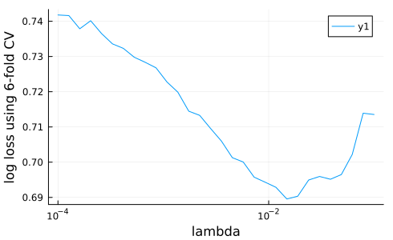
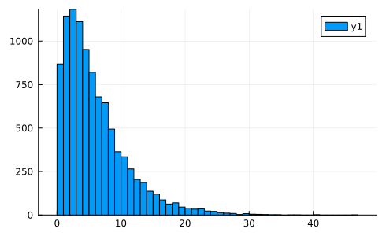
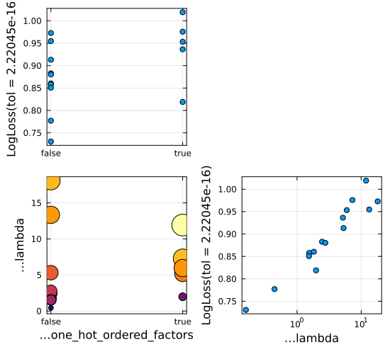

```@meta
EditURL = "notebook.jl"
```

# Tutorial 4. Tuning hyperparameters

> **Goals:** Learn how to:
> 1. Tune (optimize) a single model hyperparameter visually, by plotting learning curves
> 2. Implement the optimization of one or more hyperparameters by wrapping a model in a tuning strategy

To run the code in this tutorial in a live Julia session, first follow the instructions
given [here](@ref instructions).

### Naive tuning of a single parameter

The most naive way to tune a single hyperparameter is to use
`learning_curve`, which we already saw in Tutorial 2. Let's see this in
the Horse Colic classification problem, a case where the parameter
to be tuned is *nested* (because the model is a pipeline).

Here is the Horse Colic data again, with the type coercions we
already discussed in Tutorial 1:

````@julia
using MLJ
import Downloads, CSV, DataFrames
url = "https://raw.githubusercontent.com/ablaom/"*
    "MachineLearningInJulia2020/"*
    "for-MLJ-version-0.16/data/horse.csv"
csv_file = Downloads.download(url)
horse = CSV.read(csv_file, DataFrames.DataFrame)
coerce!(horse, autotype(horse));
coerce!(horse, Count => Continuous);
coerce!(
    horse,
    :surgery               => Multiclass,
    :age                   => Multiclass,
    :mucous_membranes      => Multiclass,
    :capillary_refill_time => Multiclass,
    :outcome               => Multiclass,
    :cp_data               => Multiclass,
);
schema(horse)

y, X = unpack(horse, ==(:outcome));
schema(X)
````

````
┌─────────────────────────┬──────────────────┬─────────────────────────────────┐
│ names                   │ scitypes         │ types                           │
├─────────────────────────┼──────────────────┼─────────────────────────────────┤
│ surgery                 │ Multiclass{2}    │ CategoricalValue{Int64, UInt32} │
│ age                     │ Multiclass{2}    │ CategoricalValue{Int64, UInt32} │
│ rectal_temperature      │ Continuous       │ Float64                         │
│ pulse                   │ Continuous       │ Float64                         │
│ respiratory_rate        │ Continuous       │ Float64                         │
│ temperature_extremities │ OrderedFactor{4} │ CategoricalValue{Int64, UInt32} │
│ mucous_membranes        │ Multiclass{6}    │ CategoricalValue{Int64, UInt32} │
│ capillary_refill_time   │ Multiclass{3}    │ CategoricalValue{Int64, UInt32} │
│ pain                    │ OrderedFactor{5} │ CategoricalValue{Int64, UInt32} │
│ peristalsis             │ OrderedFactor{4} │ CategoricalValue{Int64, UInt32} │
│ abdominal_distension    │ OrderedFactor{4} │ CategoricalValue{Int64, UInt32} │
│ packed_cell_volume      │ Continuous       │ Float64                         │
│ total_protein           │ Continuous       │ Float64                         │
│ surgical_lesion         │ OrderedFactor{2} │ CategoricalValue{Int64, UInt32} │
│ cp_data                 │ Multiclass{2}    │ CategoricalValue{Int64, UInt32} │
└─────────────────────────┴──────────────────┴─────────────────────────────────┘

````

Now for a pipeline model:

````@julia
LogisticClassifier = @load LogisticClassifier pkg=MLJLinearModels
model = Standardizer |> ContinuousEncoder |> LogisticClassifier
````

````
ProbabilisticPipeline(
  standardizer = Standardizer(
        features = Symbol[], 
        ignore = false, 
        ordered_factor = false, 
        count = false), 
  continuous_encoder = ContinuousEncoder(
        drop_last = false, 
        one_hot_ordered_factors = false), 
  logistic_classifier = LogisticClassifier(
        lambda = 2.220446049250313e-16, 
        gamma = 0.0, 
        penalty = :l2, 
        fit_intercept = true, 
        penalize_intercept = false, 
        scale_penalty_with_samples = true, 
        solver = nothing), 
  cache = true)
````

````@julia
mach = machine(model, X, y);
````

We now specify a hyperparameter range for this pipeline model:

````@julia
r = range(model, :(logistic_classifier.lambda), lower = 1e-4, upper=0.1, scale=:log10)
````

````
NumericRange(0.0001 ≤ logistic_classifier.lambda ≤ 0.1; origin=0.05005, unit=0.04995; on log10 scale)
````

If you're curious, you can see what `lambda` values this range will
generate for a given resolution:

````@julia
iterator(r, 5)
````

````
5-element Vector{Float64}:
 0.0001
 0.0005623413251903491
 0.0031622776601683794
 0.01778279410038923
 0.1
````

````@julia
using Plots
gr(size=(490,300))
_, _, lambdas, losses = learning_curve(
    mach,
    range=r,
    resampling=CV(nfolds=6),
    resolution=30, # default
    measure=log_loss,
)
plt=plot(lambdas, losses, xscale=:log10)
xlabel!(plt, "lambda")
ylabel!(plt, "log loss using 6-fold CV")
savefig("learning_curve2.png")
````

````
"/home/runner/work/MLJTutorial.jl/MLJTutorial.jl/docs/src/notebooks/MLJTutorial/04_tuning/learning_curve2.png"
````



````@julia
best_lambda = lambdas[argmin(losses)]
````

````
0.0117210229753348
````

### Self tuning models

A more sophisticated way to view hyperparameter tuning (inspired by
[mlr](https://mlr.mlr-org.com)) is as a model *wrapper*. The wrapped model is a new
model in its own right and when you fit it, it tunes specified hyperparameters of the
model being wrapped, before training on all supplied data. Calling `predict` on the
wrapped model is like calling `predict` on the original model, but with the
hyperparameters already optimized.

In other words, we can think of the wrapped model as a "self-tuning" version of the
original.

We now create a self-tuning version of the pipeline above, adding a parameter from the
`ContinuousEncoder` to the parameters we want optimized.

First, let's choose a tuning strategy (from [these
options](https://github.com/juliaai/MLJTuning.jl#what-is-provided-here)). MLJ supports
ordinary `Grid` search (query `?Grid` for details). However, as the utility of `Grid`
search is limited to a small number of parameters, and as `Grid` searches are
demonstrated elsewhere (see the [resources below](#resources-for-part-4)) we'll
demonstrate `RandomSearch` here:

````@julia
tuning = RandomSearch(rng=123)
````

````
RandomSearch(
  bounded = Distributions.Uniform, 
  positive_unbounded = Distributions.Gamma, 
  other = Distributions.Normal, 
  rng = Random.MersenneTwister(123))
````

In this strategy each parameter is sampled according to a pre-specified prior
distribution that is fit to the one-dimensional range object constructed using `range`
as before. While one has a lot of control over the specification of the priors (run
`?RandomSearch` for details) we'll let the algorithm generate these priors
automatically.

#### Unbounded ranges and sampling

In MLJ a range does not have to be bounded. In a `RandomSearch` a positive unbounded
range is sampled using a `Gamma` distribution, by default:

````@julia
r = range(
    model,
    :(logistic_classifier.lambda),
    lower=0,
    origin=6,
    unit=5,
    scale=:log10,
)
````

````
NumericRange(0 ≤ logistic_classifier.lambda ≤ Inf; origin=6.0, unit=5.0; on log10 scale)
````

The `scale` in a range is ignored in a `RandomSearch`, unless it is a
function. (It *is* relevant in a `Grid` search, not demonstrated
here.) Note however, the choice of scale *does* effect how later plots
will look.

Let's see what sampling using a Gamma distribution is going to mean
for this range:

````@julia
import Distributions
sampler_r = sampler(r, Distributions.Gamma)
plt = histogram(rand(sampler_r, 10000), nbins=50)
savefig("gamma_sampler.png");
````



The second parameter that we'll add to this is *nominal* (finite) and, by
default, will be sampled uniformly. Since it is nominal, we specify
`values` instead of `upper` and `lower` bounds:

````@julia
s  = range(
    model,
    :(continuous_encoder.one_hot_ordered_factors),
    values = [true, false],
)
````

````
NominalRange(continuous_encoder.one_hot_ordered_factors = true, false)
````

#### The tuning wrapper

Now for the wrapper, which is an instance of `TunedModel`:

````@julia
tuned_model = TunedModel(
    model,
    ranges=[r, s],
    resampling=CV(nfolds=6),
    measures=log_loss,
    tuning=tuning,
    n=15,
)
````

````
ProbabilisticTunedModel(
  model = ProbabilisticPipeline(
        standardizer = Standardizer(features = Symbol[], …), 
        continuous_encoder = ContinuousEncoder(drop_last = false, …), 
        logistic_classifier = LogisticClassifier(lambda = 2.220446049250313e-16, …), 
        cache = true), 
  tuning = RandomSearch(
        bounded = Distributions.Uniform, 
        positive_unbounded = Distributions.Gamma, 
        other = Distributions.Normal, 
        rng = Random.MersenneTwister(123)), 
  resampling = CV(
        nfolds = 6, 
        shuffle = false, 
        rng = Random.TaskLocalRNG()), 
  measure = LogLoss(tol = 2.22045e-16), 
  weights = nothing, 
  class_weights = nothing, 
  operation = nothing, 
  range = MLJBase.ParamRange[NumericRange(0 ≤ logistic_classifier.lambda ≤ Inf; origin=6.0, unit=5.0; on log10 scale), NominalRange(continuous_encoder.one_hot_ordered_factors = true, false)], 
  selection_heuristic = MLJTuning.NaiveSelection(nothing), 
  train_best = true, 
  repeats = 1, 
  n = 15, 
  acceleration = ComputationalResources.CPU1{Nothing}(nothing), 
  acceleration_resampling = ComputationalResources.CPU1{Nothing}(nothing), 
  check_measure = true, 
  cache = true, 
  compact_history = true, 
  logger = nothing)
````

We can apply the `fit!/predict` work-flow to `tuned_model` just as
for any other model:

````@julia
tuned_mach = machine(tuned_model, X, y)
fit!(tuned_mach)
predict(tuned_mach, rows=1:3)
````

````
3-element CategoricalDistributions.UnivariateFiniteVector{ScientificTypesBase.Multiclass{3}, Int64, UInt32, Float64}:
 UnivariateFinite{ScientificTypesBase.Multiclass{3}}(1=>0.643, 2=>0.244, 3=>0.114)
 UnivariateFinite{ScientificTypesBase.Multiclass{3}}(1=>0.658, 2=>0.0938, 3=>0.248)
 UnivariateFinite{ScientificTypesBase.Multiclass{3}}(1=>0.884, 2=>0.0727, 3=>0.043)
````

The outcomes of the tuning can be inspected from a detailed
report. For example, we have:

````@julia
rep = report(tuned_mach)
rep.best_model
````

````
ProbabilisticPipeline(
  standardizer = Standardizer(
        features = Symbol[], 
        ignore = false, 
        ordered_factor = false, 
        count = false), 
  continuous_encoder = ContinuousEncoder(
        drop_last = false, 
        one_hot_ordered_factors = false), 
  logistic_classifier = LogisticClassifier(
        lambda = 0.15909603030140035, 
        gamma = 0.0, 
        penalty = :l2, 
        fit_intercept = true, 
        penalize_intercept = false, 
        scale_penalty_with_samples = true, 
        solver = nothing), 
  cache = true)
````

You can also visualize the random search:

````@julia
plt = plot(tuned_mach)
savefig("tuning.png");
````



Finally, let's compare cross-validation estimate of the performance of the self-tuning
model with that of the original model (an example of [*nested
resampling*](https://mlr.mlr-org.com/articles/tutorial/nested_resampling.html)):

````@julia
err = evaluate!(mach, resampling=CV(nfolds=3), measure=log_loss)
````

````
PerformanceEvaluation object with these fields:
  model, tag, measure, operation,
  measurement, uncertainty_radius_95, per_fold, per_observation,
  fitted_params_per_fold, report_per_fold,
  train_test_rows, resampling, repeats
Tag: ProbabilisticPipeline-973
Extract:
┌──────────────────────┬───────────┬─────────────┐
│ measure              │ operation │ measurement │
├──────────────────────┼───────────┼─────────────┤
│ LogLoss(             │ predict   │ 0.782       │
│   tol = 2.22045e-16) │           │             │
└──────────────────────┴───────────┴─────────────┘
┌──────────────────────┬─────────┐
│ per_fold             │ 1.96*SE │
├──────────────────────┼─────────┤
│ [0.83, 0.721, 0.794] │ 0.0773  │
└──────────────────────┴─────────┘

````

````@julia
tuned_err = evaluate!(tuned_mach, resampling=CV(nfolds=3), measure=log_loss)
````

````
PerformanceEvaluation object with these fields:
  model, tag, measure, operation,
  measurement, uncertainty_radius_95, per_fold, per_observation,
  fitted_params_per_fold, report_per_fold,
  train_test_rows, resampling, repeats
Tag: ProbabilisticTunedModel-287
Extract:
┌──────────────────────┬───────────┬─────────────┐
│ measure              │ operation │ measurement │
├──────────────────────┼───────────┼─────────────┤
│ LogLoss(             │ predict   │ 0.779       │
│   tol = 2.22045e-16) │           │             │
└──────────────────────┴───────────┴─────────────┘
┌───────────────────────┬─────────┐
│ per_fold              │ 1.96*SE │
├───────────────────────┼─────────┤
│ [0.798, 0.802, 0.738] │ 0.0496  │
└───────────────────────┴─────────┘

````

### Tutorial 4 Resources

- From the MLJ manual:
   - [Learning Curves](https://juliaai.github.io/MLJ.jl/dev/learning_curves/)
   - [Tuning Models](https://juliaai.github.io/MLJ.jl/dev/tuning_models/)
- From Data Science Tutorials:
    - [Tuning a model](https://juliaai.github.io/DataScienceTutorials.jl/getting-started/model-tuning/)
    - [Crabs with XGBoost](https://juliaai.github.io/DataScienceTutorials.jl/end-to-end/crabs-xgb/) `Grid` tuning in stages for a tree-boosting model with many parameters
    - [Boston with LightGBM](https://juliaai.github.io/DataScienceTutorials.jl/end-to-end/boston-lgbm/) -  `Grid` tuning for another popular tree-booster
    - [Boston with Flux](https://juliaai.github.io/DataScienceTutorials.jl/end-to-end/boston-flux/) - optimizing batch size in a simple neural network regressor
- [UCI Horse Colic Data Set](http://archive.ics.uci.edu/ml/datasets/Horse+Colic)

### Tutorial 4 Exercises

#### Exercise 8

This exercise continues our analysis of the King County House price
prediction problem (Exercise 3, Tutorial 1, and Tutorial 3):

````@julia
import Downloads, CSV
import DataFrames
url = "https://raw.githubusercontent.com/ablaom/"*
    "MachineLearningInJulia2020/for-MLJ-version-0.16/"*
    "data/house.csv"
csv_file = Downloads.download(url)
house = CSV.read(csv_file, DataFrames.DataFrame)
coerce!(house, autotype(house))
coerce!(house, Count => Continuous, :zipcode => Multiclass)
y, X = unpack(house, ==(:price), rng=123);
schema(X)
````

````
┌───────────────┬───────────────────┬───────────────────────────────────┐
│ names         │ scitypes          │ types                             │
├───────────────┼───────────────────┼───────────────────────────────────┤
│ bedrooms      │ OrderedFactor{13} │ CategoricalValue{Int64, UInt32}   │
│ bathrooms     │ OrderedFactor{30} │ CategoricalValue{Float64, UInt32} │
│ sqft_living   │ Continuous        │ Float64                           │
│ sqft_lot      │ Continuous        │ Float64                           │
│ floors        │ OrderedFactor{6}  │ CategoricalValue{Float64, UInt32} │
│ waterfront    │ OrderedFactor{2}  │ CategoricalValue{Int64, UInt32}   │
│ view          │ OrderedFactor{5}  │ CategoricalValue{Int64, UInt32}   │
│ condition     │ OrderedFactor{5}  │ CategoricalValue{Int64, UInt32}   │
│ grade         │ OrderedFactor{12} │ CategoricalValue{Int64, UInt32}   │
│ sqft_above    │ Continuous        │ Float64                           │
│ sqft_basement │ Continuous        │ Float64                           │
│ yr_built      │ Continuous        │ Float64                           │
│ zipcode       │ Multiclass{70}    │ CategoricalValue{Int64, UInt32}   │
│ lat           │ Continuous        │ Float64                           │
│ long          │ Continuous        │ Float64                           │
│ sqft_living15 │ Continuous        │ Float64                           │
│ sqft_lot15    │ Continuous        │ Float64                           │
│ is_renovated  │ OrderedFactor{2}  │ CategoricalValue{Bool, UInt32}    │
└───────────────┴───────────────────┴───────────────────────────────────┘

````

Your task will be to tune the following pipeline regression model,
which includes a gradient tree boosting component:

````@julia
EvoTreeRegressor = @load EvoTreeRegressor
tree_booster = EvoTreeRegressor(nrounds = 70)
model = ContinuousEncoder |> tree_booster
````

````
DeterministicPipeline(
  continuous_encoder = ContinuousEncoder(
        drop_last = false, 
        one_hot_ordered_factors = false), 
  evo_tree_regressor = EvoTreeRegressor(
        loss = :mse, 
        metric = :mse, 
        nrounds = 70, 
        bagging_size = 1, 
        early_stopping_rounds = 9223372036854775807, 
        L2 = 1.0, 
        lambda = 0.0, 
        gamma = 0.0, 
        eta = 0.1, 
        max_depth = 6, 
        min_weight = 1.0, 
        rowsample = 1.0, 
        colsample = 1.0, 
        nbins = 64, 
        alpha = 0.5, 
        alphas = [0.1, 0.5, 0.9], 
        monotone_constraints = Dict{Int64, Int64}(), 
        tree_type = :binary, 
        seed = 123, 
        device = :cpu), 
  cache = true)
````

(a) Construct a bounded range `r1` for the `evo_tree_booster`
parameter `max_depth`, varying between 1 and 12.

(b) For the `colsample` parameter of the `EvoTreeRegressor`, define the range

````@julia
r2 = range(model, :(evo_tree_regressor.colsample), lower=0.5, upper=1.0)
````

````
NumericRange(0.5 ≤ evo_tree_regressor.colsample ≤ 1.0; origin=0.75, unit=0.25)
````

Optimize `model` over these the parameter ranges `r1` and `r2` using a random search
with uniform priors (the default). Use `Holdout()` resampling, and implement your search
by first constructing a "self-tuning" wrap of `model`, as described above. Make `mae`
(mean absolute error) the loss function that you optimize, and search over a total of 40
combinations of hyperparameters.  If you have time, plot the results of your
search. Feel free to use all available data.

(c) Evaluate the best model found in the search using 3-fold cross-validation and
compare with that of the self-tuning model (which is different!). Setting data hygiene
concerns aside, use all available data.

---

*This page was generated using [Literate.jl](https://github.com/fredrikekre/Literate.jl).*

