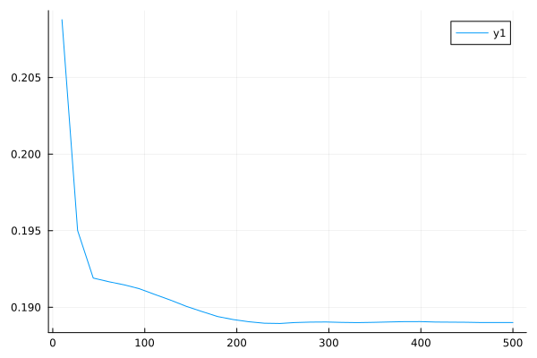
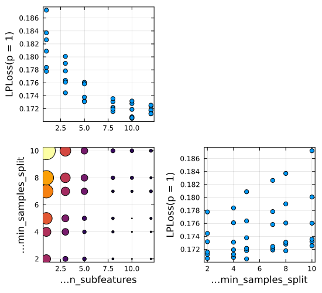
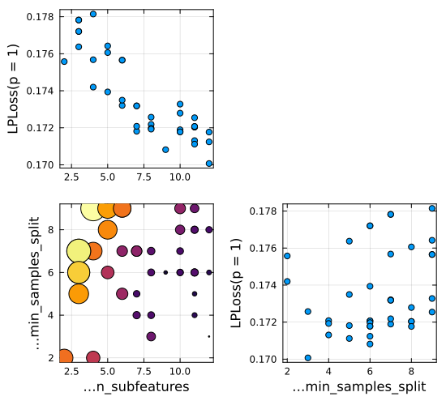

```@meta
EditURL = "notebook.jl"
```

# Lesson 3. Model Tuning

Notebook supporting the video series "Using MLJ".

To run the code in this tutorial in a live Julia session, first follow the instructions
given [here](@ref instructions).

## Part I. Learning Curves

````@julia
using MLJ, Plots
RandomForestRegressor = @load RandomForestRegressor pkg=DecisionTree

X, price = @load_reduced_ames;
schema(X)
````

````
┌──────────────┬───────────────────┬──────────────────────────────────┐
│ names        │ scitypes          │ types                            │
├──────────────┼───────────────────┼──────────────────────────────────┤
│ OverallQual  │ OrderedFactor{10} │ CategoricalValue{Int64, UInt32}  │
│ GrLivArea    │ Continuous        │ Float64                          │
│ Neighborhood │ Multiclass{25}    │ CategoricalValue{String, UInt32} │
│ x1stFlrSF    │ Continuous        │ Float64                          │
│ TotalBsmtSF  │ Continuous        │ Float64                          │
│ BsmtFinSF1   │ Continuous        │ Float64                          │
│ LotArea      │ Continuous        │ Float64                          │
│ GarageCars   │ Count             │ Int64                            │
│ MSSubClass   │ Multiclass{15}    │ CategoricalValue{String, UInt32} │
│ GarageArea   │ Continuous        │ Float64                          │
│ YearRemodAdd │ Count             │ Int64                            │
│ YearBuilt    │ Count             │ Int64                            │
└──────────────┴───────────────────┴──────────────────────────────────┘

````

````@julia
y = price/100_000; # price in multiples of $100,000
first(y, 5)
````

````
5-element Vector{Float64}:
 1.38
 3.699
 1.8
 2.075
 1.47
````

Define a model and a "dummy" model for baseline comparison:

````@julia
model = RandomForestRegressor(
    rng=123,
    n_subfeatures=1,
)
pipe =  ContinuousEncoder() |> model
baseline = ContinuousEncoder() |>  ConstantRegressor();
````

Get a performance baseline:

````@julia
options = (; resampling=CV(nfolds=3), measure = mae, acceleration=CPUThreads())
e0 = evaluate(pipe, X, y; options...)
ebase = evaluate(baseline, X, y; options...)
````

````
PerformanceEvaluation object with these fields:
  model, tag, measure, operation,
  measurement, uncertainty_radius_95, per_fold, per_observation,
  fitted_params_per_fold, report_per_fold,
  train_test_rows, resampling, repeats
Tag: ProbabilisticPipeline-228
Extract:
┌──────────┬──────────────┬─────────────┐
│ measure  │ operation    │ measurement │
├──────────┼──────────────┼─────────────┤
│ LPLoss(  │ predict_mean │ 0.568       │
│   p = 1) │              │             │
└──────────┴──────────────┴─────────────┘
┌──────────────────────┬─────────┐
│ per_fold             │ 1.96*SE │
├──────────────────────┼─────────┤
│ [0.544, 0.57, 0.592] │ 0.0332  │
└──────────────────────┴─────────┘

````

Inspect hyper-parameters:

````@julia
pipe
````

````
DeterministicPipeline(
  continuous_encoder = ContinuousEncoder(
        drop_last = false, 
        one_hot_ordered_factors = false), 
  random_forest_regressor = RandomForestRegressor(
        max_depth = -1, 
        min_samples_leaf = 1, 
        min_samples_split = 2, 
        min_purity_increase = 0.0, 
        n_subfeatures = 1, 
        n_trees = 100, 
        sampling_fraction = 0.7, 
        feature_importance = :impurity, 
        rng = 123), 
  cache = true)
````

Define a 1D hyper-parameter range:

````@julia
r = range(pipe, :(random_forest_regressor.n_trees), lower=10, upper=500)
````

````
NumericRange(10 ≤ random_forest_regressor.n_trees ≤ 500; origin=255.0, unit=245.0)
````

A `learning_curve` has the same arguments as `evaluate` except but with extra `range`
option:

````@julia
curve = learning_curve(
    pipe, X, y;
    range=r,
    resampling=Holdout(fraction_train=0.8),
    measure=mae,
)
plt = plot(curve.parameter_values, curve.measurements)
savefig("learning_curve.svg");
````

````
[ Info: Training machine(DeterministicTunedModel(model = DeterministicPipeline(continuous_encoder = ContinuousEncoder(drop_last = false, …), …), …), …).
[ Info: Attempting to evaluate 30 models.

Evaluating over 30 metamodels:   7%[=>                       ]  ETA: 0:00:00
Evaluating over 30 metamodels:  10%[==>                      ]  ETA: 0:00:01
Evaluating over 30 metamodels:  13%[===>                     ]  ETA: 0:00:01
Evaluating over 30 metamodels:  17%[====>                    ]  ETA: 0:00:01
Evaluating over 30 metamodels:  20%[=====>                   ]  ETA: 0:00:02
Evaluating over 30 metamodels:  23%[=====>                   ]  ETA: 0:00:02
Evaluating over 30 metamodels:  27%[======>                  ]  ETA: 0:00:02
Evaluating over 30 metamodels:  30%[=======>                 ]  ETA: 0:00:02
Evaluating over 30 metamodels:  33%[========>                ]  ETA: 0:00:03
Evaluating over 30 metamodels:  37%[=========>               ]  ETA: 0:00:03
Evaluating over 30 metamodels:  40%[==========>              ]  ETA: 0:00:03
Evaluating over 30 metamodels:  43%[==========>              ]  ETA: 0:00:03
Evaluating over 30 metamodels:  47%[===========>             ]  ETA: 0:00:04
Evaluating over 30 metamodels:  50%[============>            ]  ETA: 0:00:04
Evaluating over 30 metamodels:  53%[=============>           ]  ETA: 0:00:04
Evaluating over 30 metamodels:  57%[==============>          ]  ETA: 0:00:04
Evaluating over 30 metamodels:  60%[===============>         ]  ETA: 0:00:04
Evaluating over 30 metamodels:  63%[===============>         ]  ETA: 0:00:04
Evaluating over 30 metamodels:  67%[================>        ]  ETA: 0:00:04
Evaluating over 30 metamodels:  70%[=================>       ]  ETA: 0:00:04
Evaluating over 30 metamodels:  73%[==================>      ]  ETA: 0:00:04
Evaluating over 30 metamodels:  77%[===================>     ]  ETA: 0:00:04
Evaluating over 30 metamodels:  80%[====================>    ]  ETA: 0:00:04
Evaluating over 30 metamodels:  83%[====================>    ]  ETA: 0:00:03
Evaluating over 30 metamodels:  87%[=====================>   ]  ETA: 0:00:03
Evaluating over 30 metamodels:  90%[======================>  ]  ETA: 0:00:02
Evaluating over 30 metamodels:  93%[=======================> ]  ETA: 0:00:02
Evaluating over 30 metamodels:  97%[========================>]  ETA: 0:00:01
Evaluating over 30 metamodels: 100%[=========================] Time: 0:00:28

````



Let's set `n_trees` to a a value that looks sufficient to get convergence:

````@julia
pipe.random_forest_regressor.n_trees = 250;
````

## Part II. The `TunedModel` Wrapper

````@julia
r1 = range(pipe, :(random_forest_regressor.n_subfeatures), lower=1, upper=12)
r2 = range(pipe, :(random_forest_regressor.min_samples_split), lower=2, upper=10)
````

````
NumericRange(2 ≤ random_forest_regressor.min_samples_split ≤ 10; origin=6.0, unit=4.0)
````

Here's how we wrap our pipeline model in grid search optimization of the parameters
specified by the above ranges:

````@julia
tuned_pipe = TunedModel(
    pipe,
    range=[r1, r2],
    tuning=Grid(goal=40),
    resampling=CV(nfolds=4),
    measures=mae,
)
````

````
DeterministicTunedModel(
  model = DeterministicPipeline(
        continuous_encoder = ContinuousEncoder(drop_last = false, …), 
        random_forest_regressor = RandomForestRegressor(max_depth = -1, …), 
        cache = true), 
  tuning = Grid(
        goal = 40, 
        resolution = 10, 
        shuffle = true, 
        rng = Random.TaskLocalRNG()), 
  resampling = CV(
        nfolds = 4, 
        shuffle = false, 
        rng = Random.TaskLocalRNG()), 
  measure = LPLoss(p = 1), 
  weights = nothing, 
  class_weights = nothing, 
  operation = nothing, 
  range = MLJBase.NumericRange{Int64, MLJBase.Bounded, Symbol}[NumericRange(1 ≤ random_forest_regressor.n_subfeatures ≤ 12; origin=6.5, unit=5.5), NumericRange(2 ≤ random_forest_regressor.min_samples_split ≤ 10; origin=6.0, unit=4.0)], 
  selection_heuristic = MLJTuning.NaiveSelection(nothing), 
  train_best = true, 
  repeats = 1, 
  n = nothing, 
  acceleration = CPU1{Nothing}(nothing), 
  acceleration_resampling = CPU1{Nothing}(nothing), 
  check_measure = true, 
  cache = true, 
  compact_history = true, 
  logger = nothing)
````

````@julia
mach = machine(tuned_pipe, X, y) |> fit!
plt = plot(mach)
savefig("tuned_model_grid.svg");
````

````
[ Info: Training machine(DeterministicTunedModel(model = DeterministicPipeline(continuous_encoder = ContinuousEncoder(drop_last = false, …), …), …), …).
[ Info: Attempting to evaluate 36 models.

Evaluating over 36 metamodels:   0%[>                        ]  ETA: N/A
Evaluating over 36 metamodels:   3%[>                        ]  ETA: 0:00:53
Evaluating over 36 metamodels:   6%[=>                       ]  ETA: 0:00:53
Evaluating over 36 metamodels:   8%[==>                      ]  ETA: 0:00:42
Evaluating over 36 metamodels:  11%[==>                      ]  ETA: 0:00:46
Evaluating over 36 metamodels:  14%[===>                     ]  ETA: 0:00:46
Evaluating over 36 metamodels:  17%[====>                    ]  ETA: 0:00:43
Evaluating over 36 metamodels:  19%[====>                    ]  ETA: 0:00:42
Evaluating over 36 metamodels:  22%[=====>                   ]  ETA: 0:00:38
Evaluating over 36 metamodels:  25%[======>                  ]  ETA: 0:00:37
Evaluating over 36 metamodels:  28%[======>                  ]  ETA: 0:00:36
Evaluating over 36 metamodels:  31%[=======>                 ]  ETA: 0:00:34
Evaluating over 36 metamodels:  33%[========>                ]  ETA: 0:00:33
Evaluating over 36 metamodels:  36%[=========>               ]  ETA: 0:00:33
Evaluating over 36 metamodels:  39%[=========>               ]  ETA: 0:00:30
Evaluating over 36 metamodels:  42%[==========>              ]  ETA: 0:00:29
Evaluating over 36 metamodels:  44%[===========>             ]  ETA: 0:00:28
Evaluating over 36 metamodels:  47%[===========>             ]  ETA: 0:00:27
Evaluating over 36 metamodels:  50%[============>            ]  ETA: 0:00:25
Evaluating over 36 metamodels:  53%[=============>           ]  ETA: 0:00:23
Evaluating over 36 metamodels:  56%[=============>           ]  ETA: 0:00:22
Evaluating over 36 metamodels:  58%[==============>          ]  ETA: 0:00:20
Evaluating over 36 metamodels:  61%[===============>         ]  ETA: 0:00:19
Evaluating over 36 metamodels:  64%[===============>         ]  ETA: 0:00:18
Evaluating over 36 metamodels:  67%[================>        ]  ETA: 0:00:16
Evaluating over 36 metamodels:  69%[=================>       ]  ETA: 0:00:15
Evaluating over 36 metamodels:  72%[==================>      ]  ETA: 0:00:13
Evaluating over 36 metamodels:  75%[==================>      ]  ETA: 0:00:12
Evaluating over 36 metamodels:  78%[===================>     ]  ETA: 0:00:11
Evaluating over 36 metamodels:  81%[====================>    ]  ETA: 0:00:09
Evaluating over 36 metamodels:  83%[====================>    ]  ETA: 0:00:08
Evaluating over 36 metamodels:  86%[=====================>   ]  ETA: 0:00:07
Evaluating over 36 metamodels:  89%[======================>  ]  ETA: 0:00:05
Evaluating over 36 metamodels:  92%[======================>  ]  ETA: 0:00:04
Evaluating over 36 metamodels:  94%[=======================> ]  ETA: 0:00:03
Evaluating over 36 metamodels:  97%[========================>]  ETA: 0:00:01
Evaluating over 36 metamodels: 100%[=========================] Time: 0:00:48

````



````@julia
keys(report(mach))
````

````
(:best_model, :best_history_entry, :history, :best_report, :plotting)
````

````@julia
report(mach).best_model
````

````
DeterministicPipeline(
  continuous_encoder = ContinuousEncoder(
        drop_last = false, 
        one_hot_ordered_factors = false), 
  random_forest_regressor = RandomForestRegressor(
        max_depth = -1, 
        min_samples_leaf = 1, 
        min_samples_split = 5, 
        min_purity_increase = 0.0, 
        n_subfeatures = 10, 
        n_trees = 250, 
        sampling_fraction = 0.7, 
        feature_importance = :impurity, 
        rng = 123), 
  cache = true)
````

````@julia
report(mach).best_history_entry.evaluation
````

````
CompactPerformanceEvaluation object with these fields:
  model, measure, operation,
  measurement, per_fold, per_observation,
  resampling, repeats
Tag: 
Extract:
┌──────────┬───────────┬─────────────┐
│ measure  │ operation │ measurement │
├──────────┼───────────┼─────────────┤
│ LPLoss(  │ predict   │ 0.171       │
│   p = 1) │           │             │
└──────────┴───────────┴─────────────┘
┌─────────────────────────────┬─────────┐
│ per_fold                    │ 1.96*SE │
├─────────────────────────────┼─────────┤
│ [0.174, 0.16, 0.156, 0.192] │ 0.0181  │
└─────────────────────────────┴─────────┘

````

Instead we can use a random search strategy:

````@julia
tuned_pipe = TunedModel(
    pipe,
    range=[r1, r2],
    tuning=RandomSearch(rng=123),
    resampling=CV(nfolds=4),
    measures=mae,
    n=40,
)

mach = machine(tuned_pipe, X, y) |> fit!
plt = plot(mach)

savefig("tuned_model_random.svg");
````

````
[ Info: Training machine(DeterministicTunedModel(model = DeterministicPipeline(continuous_encoder = ContinuousEncoder(drop_last = false, …), …), …), …).
[ Info: Attempting to evaluate 40 models.

Evaluating over 40 metamodels:   5%[=>                       ]  ETA: 0:00:43
Evaluating over 40 metamodels:   8%[=>                       ]  ETA: 0:00:48
Evaluating over 40 metamodels:  10%[==>                      ]  ETA: 0:00:49
Evaluating over 40 metamodels:  12%[===>                     ]  ETA: 0:00:48
Evaluating over 40 metamodels:  15%[===>                     ]  ETA: 0:00:45
Evaluating over 40 metamodels:  18%[====>                    ]  ETA: 0:00:43
Evaluating over 40 metamodels:  20%[=====>                   ]  ETA: 0:00:44
Evaluating over 40 metamodels:  22%[=====>                   ]  ETA: 0:00:42
Evaluating over 40 metamodels:  25%[======>                  ]  ETA: 0:00:41
Evaluating over 40 metamodels:  28%[======>                  ]  ETA: 0:00:39
Evaluating over 40 metamodels:  30%[=======>                 ]  ETA: 0:00:39
Evaluating over 40 metamodels:  32%[========>                ]  ETA: 0:00:38
Evaluating over 40 metamodels:  35%[========>                ]  ETA: 0:00:36
Evaluating over 40 metamodels:  38%[=========>               ]  ETA: 0:00:35
Evaluating over 40 metamodels:  40%[==========>              ]  ETA: 0:00:33
Evaluating over 40 metamodels:  42%[==========>              ]  ETA: 0:00:34
Evaluating over 40 metamodels:  45%[===========>             ]  ETA: 0:00:31
Evaluating over 40 metamodels:  48%[===========>             ]  ETA: 0:00:30
Evaluating over 40 metamodels:  50%[============>            ]  ETA: 0:00:29
Evaluating over 40 metamodels:  52%[=============>           ]  ETA: 0:00:27
Evaluating over 40 metamodels:  55%[=============>           ]  ETA: 0:00:26
Evaluating over 40 metamodels:  58%[==============>          ]  ETA: 0:00:24
Evaluating over 40 metamodels:  60%[===============>         ]  ETA: 0:00:23
Evaluating over 40 metamodels:  62%[===============>         ]  ETA: 0:00:22
Evaluating over 40 metamodels:  65%[================>        ]  ETA: 0:00:20
Evaluating over 40 metamodels:  68%[================>        ]  ETA: 0:00:19
Evaluating over 40 metamodels:  70%[=================>       ]  ETA: 0:00:17
Evaluating over 40 metamodels:  72%[==================>      ]  ETA: 0:00:15
Evaluating over 40 metamodels:  75%[==================>      ]  ETA: 0:00:14
Evaluating over 40 metamodels:  78%[===================>     ]  ETA: 0:00:13
Evaluating over 40 metamodels:  80%[====================>    ]  ETA: 0:00:11
Evaluating over 40 metamodels:  82%[====================>    ]  ETA: 0:00:10
Evaluating over 40 metamodels:  85%[=====================>   ]  ETA: 0:00:08
Evaluating over 40 metamodels:  88%[=====================>   ]  ETA: 0:00:07
Evaluating over 40 metamodels:  90%[======================>  ]  ETA: 0:00:06
Evaluating over 40 metamodels:  92%[=======================> ]  ETA: 0:00:04
Evaluating over 40 metamodels:  95%[=======================> ]  ETA: 0:00:03
Evaluating over 40 metamodels:  98%[========================>]  ETA: 0:00:01
Evaluating over 40 metamodels: 100%[=========================] Time: 0:00:55

````



In-sample predictions based on optimized parameters and retraining on *all* data:

````@julia
predict(mach, X)[1:5]
````

````
5-element Vector{Float64}:
 1.3710151999999998
 3.627463819999999
 1.8085951933333335
 1.9762690599999997
 1.3529714200000003
````

Evaluate the "self-tuning" pipeline:

````@julia
e1 = evaluate(tuned_pipe, X, y; options...)
````

````
PerformanceEvaluation object with these fields:
  model, tag, measure, operation,
  measurement, uncertainty_radius_95, per_fold, per_observation,
  fitted_params_per_fold, report_per_fold,
  train_test_rows, resampling, repeats
Tag: DeterministicTunedModel-225
Extract:
┌──────────┬───────────┬─────────────┐
│ measure  │ operation │ measurement │
├──────────┼───────────┼─────────────┤
│ LPLoss(  │ predict   │ 0.175       │
│   p = 1) │           │             │
└──────────┴───────────┴─────────────┘
┌───────────────────────┬─────────┐
│ per_fold              │ 1.96*SE │
├───────────────────────┼─────────┤
│ [0.166, 0.166, 0.192] │ 0.021   │
└───────────────────────┴─────────┘

````

Comparing with the baseline computed earlier:

````@julia
@show ebase e0 e1;
````

````
ebase = PerformanceEvaluation("ProbabilisticPipeline-228", 0.568 ± 0.0332)
e0 = PerformanceEvaluation("DeterministicPipeline-525", 0.184 ± 0.0281)
e1 = PerformanceEvaluation("DeterministicTunedModel-225", 0.175 ± 0.021)

````

Or, we can do this:

````@julia
describe.([e0, e1]) |> pretty
````

````
┌─────────────────────────────┬──────────────────────┐
│ tag                         │ LPLoss               │
│ String                      │ Measurement{Float64} │
│ Textual                     │ Continuous           │
├─────────────────────────────┼──────────────────────┤
│ DeterministicPipeline-525   │ 0.184±0.028          │
│ DeterministicTunedModel-225 │ 0.175±0.021          │
└─────────────────────────────┴──────────────────────┘

````

We can also use `TunedModel` to compare models of different types:

````@julia
tuned_model = TunedModel(models=[pipe, baseline], resampling=CV(nfolds=4), measure=l1)
mach = machine(tuned_model, X, y) |> fit!
report(mach).best_model
````

````
DeterministicPipeline(
  continuous_encoder = ContinuousEncoder(
        drop_last = false, 
        one_hot_ordered_factors = false), 
  random_forest_regressor = RandomForestRegressor(
        max_depth = -1, 
        min_samples_leaf = 1, 
        min_samples_split = 2, 
        min_purity_increase = 0.0, 
        n_subfeatures = 1, 
        n_trees = 250, 
        sampling_fraction = 0.7, 
        feature_importance = :impurity, 
        rng = 123), 
  cache = true)
````

Here `tuned_model` will behave just like `pipe`, because this is the best performer.

---

*This page was generated using [Literate.jl](https://github.com/fredrikekre/Literate.jl).*

