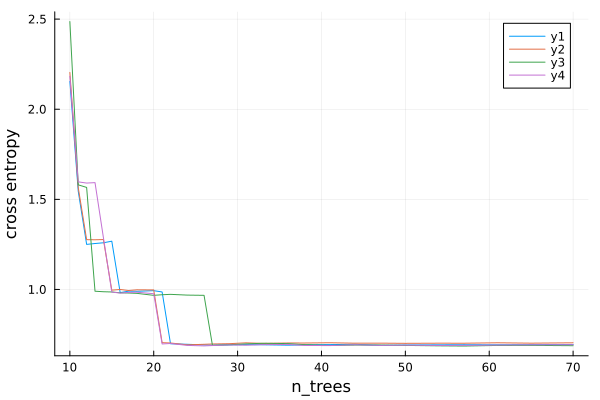
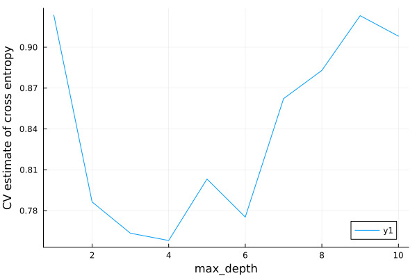
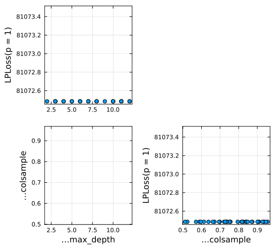

```@meta
EditURL = "notebook.jl"
```

# Solutions to Exercises

````@julia
using MLJ, Downloads, CSV, DataFrames, Plots
````

#### Exercise 1 solution

````@julia
scitype(42)
````

````
ScientificTypesBase.Count
````

````@julia
questions = ["who", "why", "what", "when"]
scitype(questions)
````

````
AbstractVector{Textual} (alias for AbstractArray{ScientificTypesBase.Textual, 1})
````

````@julia
elscitype(questions)
````

````
ScientificTypesBase.Textual
````

````@julia
t = (3.141, 42, "how")
scitype(t)
````

````
Tuple{ScientificTypesBase.Continuous, ScientificTypesBase.Count, ScientificTypesBase.Textual}
````

````@julia
A = rand(2, 3)
````

````
2×3 Matrix{Float64}:
 0.0383784  0.758964  0.664543
 0.455437   0.655434  0.552125
````

````@julia
scitype(A)
````

````
AbstractMatrix{Continuous} (alias for AbstractArray{ScientificTypesBase.Continuous, 2})
````

````@julia
elscitype(A)
````

````
ScientificTypesBase.Continuous
````

````@julia
using SparseArrays
Asparse = sparse(A)
````

````
2×3 SparseArrays.SparseMatrixCSC{Float64, Int64} with 6 stored entries:
 0.0383784  0.758964  0.664543
 0.455437   0.655434  0.552125
````

````@julia
scitype(Asparse)
````

````
AbstractMatrix{Continuous} (alias for AbstractArray{ScientificTypesBase.Continuous, 2})
````

````@julia
C = coerce(A, Multiclass)
````

````
2×3 CategoricalArrays.CategoricalArray{Float64,2,UInt32}:
 0.0383784  0.758964  0.664543
 0.455437  0.655434  0.552125
````

````@julia
scitype(C)
````

````
AbstractMatrix{Multiclass{6}} (alias for AbstractArray{ScientificTypesBase.Multiclass{6}, 2})
````

````@julia
elscitype(C)
````

````
ScientificTypesBase.Multiclass{6}
````

````@julia
v = [1, 2, missing, 4]
scitype(v)
````

````
AbstractVector{Union{Missing, Count}} (alias for AbstractArray{Union{Missing, ScientificTypesBase.Count}, 1})
````

````@julia
elscitype(v)
````

````
Union{Missing, ScientificTypesBase.Count}
````

````@julia
scitype(v[1:2])
````

````
AbstractVector{Union{Missing, Count}} (alias for AbstractArray{Union{Missing, ScientificTypesBase.Count}, 1})
````

#### Exercise 2 solution

From the question statement:

````@julia
quality = ["good", "poor", "poor", "excellent", missing, "good", "excellent"]
````

````
7-element Vector{Union{Missing, String}}:
 "good"
 "poor"
 "poor"
 "excellent"
 missing
 "good"
 "excellent"
````

````@julia
quality = coerce(quality, OrderedFactor);
levels!(quality, ["poor", "good", "excellent"]);
elscitype(quality)
````

````
Union{Missing, ScientificTypesBase.OrderedFactor{3}}
````

#### Exercise 3 solution

From the question statement:

````@julia
url = "https://raw.githubusercontent.com/ablaom/"*
    "MachineLearningInJulia2020/for-MLJ-version-0.16/"*
    "data/house.csv";
house = CSV.read(Downloads.download(url), DataFrames.DataFrame)
first(house, 4)
````

```@raw html
<div><div style = "float: left;"><span>4×19 DataFrame</span></div><div style = "clear: both;"></div></div><div class = "data-frame" style = "overflow-x: scroll;"><table class = "data-frame" style = "margin-bottom: 6px;"><thead><tr class = "columnLabelRow"><th class = "stubheadLabel" style = "font-weight: bold; text-align: right;">Row</th><th style = "text-align: left;">price</th><th style = "text-align: left;">bedrooms</th><th style = "text-align: left;">bathrooms</th><th style = "text-align: left;">sqft_living</th><th style = "text-align: left;">sqft_lot</th><th style = "text-align: left;">floors</th><th style = "text-align: left;">waterfront</th><th style = "text-align: left;">view</th><th style = "text-align: left;">condition</th><th style = "text-align: left;">grade</th><th style = "text-align: left;">sqft_above</th><th style = "text-align: left;">sqft_basement</th><th style = "text-align: left;">yr_built</th><th style = "text-align: left;">zipcode</th><th style = "text-align: left;">lat</th><th style = "text-align: left;">long</th><th style = "text-align: left;">sqft_living15</th><th style = "text-align: left;">sqft_lot15</th><th style = "text-align: left;">is_renovated</th></tr><tr class = "columnLabelRow"><th class = "stubheadLabel" style = "font-weight: bold; text-align: right;"></th><th title = "Float64" style = "text-align: left;">Float64</th><th title = "Int64" style = "text-align: left;">Int64</th><th title = "Float64" style = "text-align: left;">Float64</th><th title = "Int64" style = "text-align: left;">Int64</th><th title = "Int64" style = "text-align: left;">Int64</th><th title = "Float64" style = "text-align: left;">Float64</th><th title = "Int64" style = "text-align: left;">Int64</th><th title = "Int64" style = "text-align: left;">Int64</th><th title = "Int64" style = "text-align: left;">Int64</th><th title = "Int64" style = "text-align: left;">Int64</th><th title = "Int64" style = "text-align: left;">Int64</th><th title = "Int64" style = "text-align: left;">Int64</th><th title = "Int64" style = "text-align: left;">Int64</th><th title = "Int64" style = "text-align: left;">Int64</th><th title = "Float64" style = "text-align: left;">Float64</th><th title = "Float64" style = "text-align: left;">Float64</th><th title = "Int64" style = "text-align: left;">Int64</th><th title = "Int64" style = "text-align: left;">Int64</th><th title = "Bool" style = "text-align: left;">Bool</th></tr></thead><tbody><tr class = "dataRow"><td class = "rowLabel" style = "font-weight: bold; text-align: right;">1</td><td style = "text-align: right;">221900.0</td><td style = "text-align: right;">3</td><td style = "text-align: right;">1.0</td><td style = "text-align: right;">1180</td><td style = "text-align: right;">5650</td><td style = "text-align: right;">1.0</td><td style = "text-align: right;">0</td><td style = "text-align: right;">0</td><td style = "text-align: right;">3</td><td style = "text-align: right;">7</td><td style = "text-align: right;">1180</td><td style = "text-align: right;">0</td><td style = "text-align: right;">1955</td><td style = "text-align: right;">98178</td><td style = "text-align: right;">47.5112</td><td style = "text-align: right;">-122.257</td><td style = "text-align: right;">1340</td><td style = "text-align: right;">5650</td><td style = "text-align: right;">true</td></tr><tr class = "dataRow"><td class = "rowLabel" style = "font-weight: bold; text-align: right;">2</td><td style = "text-align: right;">538000.0</td><td style = "text-align: right;">3</td><td style = "text-align: right;">2.25</td><td style = "text-align: right;">2570</td><td style = "text-align: right;">7242</td><td style = "text-align: right;">2.0</td><td style = "text-align: right;">0</td><td style = "text-align: right;">0</td><td style = "text-align: right;">3</td><td style = "text-align: right;">7</td><td style = "text-align: right;">2170</td><td style = "text-align: right;">400</td><td style = "text-align: right;">1951</td><td style = "text-align: right;">98125</td><td style = "text-align: right;">47.721</td><td style = "text-align: right;">-122.319</td><td style = "text-align: right;">1690</td><td style = "text-align: right;">7639</td><td style = "text-align: right;">false</td></tr><tr class = "dataRow"><td class = "rowLabel" style = "font-weight: bold; text-align: right;">3</td><td style = "text-align: right;">180000.0</td><td style = "text-align: right;">2</td><td style = "text-align: right;">1.0</td><td style = "text-align: right;">770</td><td style = "text-align: right;">10000</td><td style = "text-align: right;">1.0</td><td style = "text-align: right;">0</td><td style = "text-align: right;">0</td><td style = "text-align: right;">3</td><td style = "text-align: right;">6</td><td style = "text-align: right;">770</td><td style = "text-align: right;">0</td><td style = "text-align: right;">1933</td><td style = "text-align: right;">98028</td><td style = "text-align: right;">47.7379</td><td style = "text-align: right;">-122.233</td><td style = "text-align: right;">2720</td><td style = "text-align: right;">8062</td><td style = "text-align: right;">true</td></tr><tr class = "dataRow"><td class = "rowLabel" style = "font-weight: bold; text-align: right;">4</td><td style = "text-align: right;">604000.0</td><td style = "text-align: right;">4</td><td style = "text-align: right;">3.0</td><td style = "text-align: right;">1960</td><td style = "text-align: right;">5000</td><td style = "text-align: right;">1.0</td><td style = "text-align: right;">0</td><td style = "text-align: right;">0</td><td style = "text-align: right;">5</td><td style = "text-align: right;">7</td><td style = "text-align: right;">1050</td><td style = "text-align: right;">910</td><td style = "text-align: right;">1965</td><td style = "text-align: right;">98136</td><td style = "text-align: right;">47.5208</td><td style = "text-align: right;">-122.393</td><td style = "text-align: right;">1360</td><td style = "text-align: right;">5000</td><td style = "text-align: right;">true</td></tr></tbody></table></div>
```

First pass:

````@julia
coerce!(house, autotype(house));
schema(house)
````

````
┌───────────────┬───────────────────┬───────────────────────────────────┐
│ names         │ scitypes          │ types                             │
├───────────────┼───────────────────┼───────────────────────────────────┤
│ price         │ Continuous        │ Float64                           │
│ bedrooms      │ OrderedFactor{13} │ CategoricalValue{Int64, UInt32}   │
│ bathrooms     │ OrderedFactor{30} │ CategoricalValue{Float64, UInt32} │
│ sqft_living   │ Count             │ Int64                             │
│ sqft_lot      │ Count             │ Int64                             │
│ floors        │ OrderedFactor{6}  │ CategoricalValue{Float64, UInt32} │
│ waterfront    │ OrderedFactor{2}  │ CategoricalValue{Int64, UInt32}   │
│ view          │ OrderedFactor{5}  │ CategoricalValue{Int64, UInt32}   │
│ condition     │ OrderedFactor{5}  │ CategoricalValue{Int64, UInt32}   │
│ grade         │ OrderedFactor{12} │ CategoricalValue{Int64, UInt32}   │
│ sqft_above    │ Count             │ Int64                             │
│ sqft_basement │ Count             │ Int64                             │
│ yr_built      │ Count             │ Int64                             │
│ zipcode       │ OrderedFactor{70} │ CategoricalValue{Int64, UInt32}   │
│ lat           │ Continuous        │ Float64                           │
│ long          │ Continuous        │ Float64                           │
│ sqft_living15 │ Count             │ Int64                             │
│ sqft_lot15    │ Count             │ Int64                             │
│ is_renovated  │ OrderedFactor{2}  │ CategoricalValue{Bool, UInt32}    │
└───────────────┴───────────────────┴───────────────────────────────────┘

````

All the "sqft" fields refer to "square feet" so are really `Continuous`. We'll regard
`:yr_built` (the other `Count` variable above) as `Continuous` as well. So:

````@julia
coerce!(house, Count => Continuous);
````

And `:zipcode` should not be ordered:

````@julia
coerce!(house, :zipcode => Multiclass);
schema(house)
````

````
┌───────────────┬───────────────────┬───────────────────────────────────┐
│ names         │ scitypes          │ types                             │
├───────────────┼───────────────────┼───────────────────────────────────┤
│ price         │ Continuous        │ Float64                           │
│ bedrooms      │ OrderedFactor{13} │ CategoricalValue{Int64, UInt32}   │
│ bathrooms     │ OrderedFactor{30} │ CategoricalValue{Float64, UInt32} │
│ sqft_living   │ Continuous        │ Float64                           │
│ sqft_lot      │ Continuous        │ Float64                           │
│ floors        │ OrderedFactor{6}  │ CategoricalValue{Float64, UInt32} │
│ waterfront    │ OrderedFactor{2}  │ CategoricalValue{Int64, UInt32}   │
│ view          │ OrderedFactor{5}  │ CategoricalValue{Int64, UInt32}   │
│ condition     │ OrderedFactor{5}  │ CategoricalValue{Int64, UInt32}   │
│ grade         │ OrderedFactor{12} │ CategoricalValue{Int64, UInt32}   │
│ sqft_above    │ Continuous        │ Float64                           │
│ sqft_basement │ Continuous        │ Float64                           │
│ yr_built      │ Continuous        │ Float64                           │
│ zipcode       │ Multiclass{70}    │ CategoricalValue{Int64, UInt32}   │
│ lat           │ Continuous        │ Float64                           │
│ long          │ Continuous        │ Float64                           │
│ sqft_living15 │ Continuous        │ Float64                           │
│ sqft_lot15    │ Continuous        │ Float64                           │
│ is_renovated  │ OrderedFactor{2}  │ CategoricalValue{Bool, UInt32}    │
└───────────────┴───────────────────┴───────────────────────────────────┘

````

`:bathrooms` looks like it has a lot of levels, but on further inspection we see why,
and `OrderedFactor` remains appropriate.

````@julia
import StatsBase.countmap
d = countmap(house.bathrooms)
for (level, count) in d
    println("$level \t=> $count")
end
````

````
5.0 	=> 21
5.25 	=> 13
1.25 	=> 9
8.0 	=> 2
6.75 	=> 2
1.0 	=> 3852
5.5 	=> 10
0.0 	=> 10
6.0 	=> 6
6.25 	=> 2
4.75 	=> 23
3.25 	=> 589
3.0 	=> 753
2.25 	=> 2047
0.5 	=> 4
7.5 	=> 1
5.75 	=> 4
1.5 	=> 1446
3.75 	=> 155
4.0 	=> 136
4.25 	=> 79
2.0 	=> 1930
2.75 	=> 1185
3.5 	=> 731
6.5 	=> 2
1.75 	=> 3048
0.75 	=> 72
2.5 	=> 5380
4.5 	=> 100
7.75 	=> 1

````

#### Exercise 4 solution

From the question statement:

````@julia
import Distributions
poisson = Distributions.Poisson

age = 18 .+ 60*rand(10);
salary = coerce(rand(["small", "big", "huge"], 10), OrderedFactor);
levels!(salary, ["small", "big", "huge"]);
small = salary[1]

X4 = DataFrames.DataFrame(age=age, salary=salary)

n_devices(salary) = salary > small ? rand(poisson(1.3)) : rand(poisson(2.9))
y4 = [n_devices(row.salary) for row in eachrow(X4)]
````

````
10-element Vector{Int64}:
 1
 1
 5
 2
 2
 2
 0
 5
 5
 0
````

4(a)

````@julia
models(matching(X4, y4))
````

````
2-element Vector{NamedTuple{(:name, :package_name, :is_supervised, :abstract_type, :constructor, :deep_properties, :docstring, :fit_data_scitype, :human_name, :hyperparameter_ranges, :hyperparameter_types, :hyperparameters, :implemented_methods, :inverse_transform_scitype, :is_pure_julia, :is_wrapper, :iteration_parameter, :load_path, :package_license, :package_url, :package_uuid, :predict_scitype, :prediction_type, :reporting_operations, :reports_feature_importances, :supports_class_weights, :supports_online, :supports_training_losses, :supports_weights, :tags, :target_in_fit, :transform_scitype, :input_scitype, :target_scitype, :output_scitype)}}:
 (name = EvoTreeCount, package_name = EvoTrees, ... )
 (name = LinearCountRegressor, package_name = GLM, ... )
````

4(b)

````@julia
y4 = coerce(y4, Continuous);
models(matching(X4, y4))
````

````
13-element Vector{NamedTuple{(:name, :package_name, :is_supervised, :abstract_type, :constructor, :deep_properties, :docstring, :fit_data_scitype, :human_name, :hyperparameter_ranges, :hyperparameter_types, :hyperparameters, :implemented_methods, :inverse_transform_scitype, :is_pure_julia, :is_wrapper, :iteration_parameter, :load_path, :package_license, :package_url, :package_uuid, :predict_scitype, :prediction_type, :reporting_operations, :reports_feature_importances, :supports_class_weights, :supports_online, :supports_training_losses, :supports_weights, :tags, :target_in_fit, :transform_scitype, :input_scitype, :target_scitype, :output_scitype)}}:
 (name = CatBoostRegressor, package_name = CatBoost, ... )
 (name = ConstantRegressor, package_name = MLJModels, ... )
 (name = DecisionTreeRegressor, package_name = BetaML, ... )
 (name = DecisionTreeRegressor, package_name = DecisionTree, ... )
 (name = DeterministicConstantRegressor, package_name = MLJModels, ... )
 (name = EvoLinearRegressor, package_name = EvoLinear, ... )
 (name = EvoTreeGaussian, package_name = EvoTrees, ... )
 (name = EvoTreeMLE, package_name = EvoTrees, ... )
 (name = EvoTreeRegressor, package_name = EvoTrees, ... )
 (name = LinearRegressor, package_name = GLM, ... )
 (name = NeuralNetworkRegressor, package_name = MLJFlux, ... )
 (name = RandomForestRegressor, package_name = BetaML, ... )
 (name = RandomForestRegressor, package_name = DecisionTree, ... )
````

#### Exercise 5 solution

````@julia
data = (
    a = [1, 2, 3, 4],
    b = rand(4),
    c = rand(4),
    d = coerce(["male", "female", "female", "male"], OrderedFactor),
);

using Tables
y, X, w = unpack(
    data,
    ==(:a),
    name -> elscitype(Tables.getcolumn(data, name)) == Continuous,
)
y
````

````
4-element Vector{Int64}:
 1
 2
 3
 4
````

````@julia
pretty(X)
````

````
┌────────────┬────────────┐
│ b          │ c          │
│ Float64    │ Float64    │
│ Continuous │ Continuous │
├────────────┼────────────┤
│ 0.349626   │ 0.992532   │
│ 0.371278   │ 0.939846   │
│ 0.777363   │ 0.870885   │
│ 0.574214   │ 0.606785   │
└────────────┴────────────┘

````

````@julia
w
````

````
4-element CategoricalArrays.CategoricalArray{String,1,UInt32}:
 "male"
 "female"
 "female"
 "male"
````

#### Exercise 6 solution

From the question statement:

````@julia
import Downloads
import CSV
url = "https://raw.githubusercontent.com/ablaom/"*
    "MachineLearningInJulia2020/"*
    "for-MLJ-version-0.16/data/horse.csv"
csv_file = Downloads.download(url)
horse = CSV.read(csv_file, DataFrames.DataFrame)
coerce!(horse, autotype(horse));
coerce!(horse, Count => Continuous);
coerce!(
    horse,
    :surgery               => Multiclass,
    :age                   => Multiclass,
    :mucous_membranes      => Multiclass,
    :capillary_refill_time => Multiclass,
    :outcome               => Multiclass,
    :cp_data               => Multiclass,
);
schema(horse)
````

````
┌─────────────────────────┬──────────────────┬─────────────────────────────────┐
│ names                   │ scitypes         │ types                           │
├─────────────────────────┼──────────────────┼─────────────────────────────────┤
│ surgery                 │ Multiclass{2}    │ CategoricalValue{Int64, UInt32} │
│ age                     │ Multiclass{2}    │ CategoricalValue{Int64, UInt32} │
│ rectal_temperature      │ Continuous       │ Float64                         │
│ pulse                   │ Continuous       │ Float64                         │
│ respiratory_rate        │ Continuous       │ Float64                         │
│ temperature_extremities │ OrderedFactor{4} │ CategoricalValue{Int64, UInt32} │
│ mucous_membranes        │ Multiclass{6}    │ CategoricalValue{Int64, UInt32} │
│ capillary_refill_time   │ Multiclass{3}    │ CategoricalValue{Int64, UInt32} │
│ pain                    │ OrderedFactor{5} │ CategoricalValue{Int64, UInt32} │
│ peristalsis             │ OrderedFactor{4} │ CategoricalValue{Int64, UInt32} │
│ abdominal_distension    │ OrderedFactor{4} │ CategoricalValue{Int64, UInt32} │
│ packed_cell_volume      │ Continuous       │ Float64                         │
│ total_protein           │ Continuous       │ Float64                         │
│ outcome                 │ Multiclass{3}    │ CategoricalValue{Int64, UInt32} │
│ surgical_lesion         │ OrderedFactor{2} │ CategoricalValue{Int64, UInt32} │
│ cp_data                 │ Multiclass{2}    │ CategoricalValue{Int64, UInt32} │
└─────────────────────────┴──────────────────┴─────────────────────────────────┘

````

6(a)

````@julia
y, X = unpack(
    horse,
    ==(:outcome),
    name -> elscitype(Tables.getcolumn(horse, name)) == Continuous,
)
schema(X)
````

````
┌────────────────────┬────────────┬─────────┐
│ names              │ scitypes   │ types   │
├────────────────────┼────────────┼─────────┤
│ rectal_temperature │ Continuous │ Float64 │
│ pulse              │ Continuous │ Float64 │
│ respiratory_rate   │ Continuous │ Float64 │
│ packed_cell_volume │ Continuous │ Float64 │
│ total_protein      │ Continuous │ Float64 │
└────────────────────┴────────────┴─────────┘

````

6(b)(i)

````@julia
train, test = partition(eachindex(y), 0.7)
LogisticClassifier = @load LogisticClassifier pkg=MLJLinearModels
model = LogisticClassifier()
model.lambda = 100
mach = machine(model, X, y)
fit!(mach, rows=train)
fitted_params(mach)
````

````
(classes = CategoricalArrays.CategoricalValue{Int64, UInt32}[CategoricalValue(CategoricalArrays.CategoricalPool{Int64, UInt32}([1, 2, 3]), 1), CategoricalValue(CategoricalArrays.CategoricalPool{Int64, UInt32}([1, 2, 3]), 2), CategoricalValue(CategoricalArrays.CategoricalPool{Int64, UInt32}([1, 2, 3]), 3)], coefs = Pair{Symbol, SubArray{Float64, 1, Matrix{Float64}, Tuple{Int64, Base.Slice{Base.OneTo{Int64}}}, true}}[:rectal_temperature => [0.01679940181352405, -0.006529534963799633, -0.010269866849724429], :pulse => [-0.002078922183617693, 0.00248508277505068, -0.00040616059143293954], :respiratory_rate => [-0.002078922183617693, 0.00248508277505068, -0.00040616059143293954], :packed_cell_volume => [0.0026345470622363147, 0.002707772252298626, -0.005342319314534946], :total_protein => [0.009110258500266177, -0.01679787903626504, 0.0076876205359988755]], intercept = [0.00043563961897106053, -0.00016706727792654562, -0.0005913867104289383])
````

````@julia
coefs_given_feature = Dict(fitted_params(mach).coefs)
coefs_given_feature[:pulse]

#6(b)(ii)

yhat = predict(mach, rows=test); # or predict(mach, X[test,:])
err = log_loss(yhat, y[test])
````

````
0.8334775485441969
````

6(b)(iii)

The predicted probabilities of the actual observations in the test
are given by

````@julia
p = broadcast(pdf, yhat, y[test]);
````

The number of times this probability exceeds 50% is:

````@julia
n50 = filter(x -> x > 0.5, p) |> length
````

````
58
````

Or, as a proportion:

````@julia
n50/length(test)
````

````
0.5272727272727272
````

6(b)(iv)

````@julia
misclassification_rate(mode.(yhat), y[test])
````

````
0.3181818181818182
````

6(c)(i)

````@julia
RandomForestClassifier = @load RandomForestClassifier pkg=DecisionTree
model = RandomForestClassifier()
mach = machine(model, X, y)
evaluate!(mach, resampling=CV(nfolds=6), measure=log_loss)
````

````
PerformanceEvaluation object with these fields:
  model, tag, measure, operation,
  measurement, uncertainty_radius_95, per_fold, per_observation,
  fitted_params_per_fold, report_per_fold,
  train_test_rows, resampling, repeats
Tag: RandomForestClassifier-945
Extract:
┌──────────────────────┬───────────┬─────────────┐
│ measure              │ operation │ measurement │
├──────────────────────┼───────────┼─────────────┤
│ LogLoss(             │ predict   │ 1.08        │
│   tol = 2.22045e-16) │           │             │
└──────────────────────┴───────────┴─────────────┘
┌─────────────────────────────────────────┬─────────┐
│ per_fold                                │ 1.96*SE │
├─────────────────────────────────────────┼─────────┤
│ [0.746, 1.35, 1.79, 1.27, 0.706, 0.611] │ 0.407   │
└─────────────────────────────────────────┴─────────┘

````

````@julia
r = range(model, :n_trees, lower=10, upper=70, scale=:log10)
````

````
NumericRange(10 ≤ n_trees ≤ 70; origin=40.0, unit=30.0; on log10 scale)
````

Since random forests are inherently randomized, we generate multiple
curves:

````@julia
curves = learning_curve(
    mach,
    range=r,
    resampling=Holdout(),
    measure=log_loss,
    rngs=4,
    rng_name=:rng,
)

plt = plot(curves.parameter_values, curves.measurements)
xlabel!(plt, "n_trees")
ylabel!(plt, "cross entropy")
savefig("exercise_6ci.png")
````

````
"/home/runner/work/MLJTutorial.jl/MLJTutorial.jl/docs/src/notebooks/99_solution_to_exercises/exercise_6ci.png"
````



6(c)(ii)

````@julia
evaluate!(mach, resampling=CV(nfolds=9),
                measure=log_loss,
                rows=train).measurement[1]

model.n_trees = 90
````

````
90
````

6(c)(iii)

````@julia
err_forest =
    evaluate!(mach, resampling=Holdout(), measure=log_loss).measurement[1]
````

````
0.9994802279518762
````

#### Exercise 7

7(a)

````@julia
KMeans = @load KMeans pkg=Clustering
EvoTreeClassifier = @load EvoTreeClassifier
pipe = Standardizer |>
    ContinuousEncoder |>
    KMeans(k=10) |>
    EvoTreeClassifier(nrounds=50)
````

````
ProbabilisticPipeline(
  standardizer = Standardizer(
        features = Symbol[], 
        ignore = false, 
        ordered_factor = false, 
        count = false), 
  continuous_encoder = ContinuousEncoder(
        drop_last = false, 
        one_hot_ordered_factors = false), 
  k_means = KMeans(
        k = 10, 
        metric = Distances.SqEuclidean(0.0), 
        init = :kmpp), 
  evo_tree_classifier = EvoTreeClassifier(
        loss = :mlogloss, 
        metric = :mlogloss, 
        nrounds = 50, 
        bagging_size = 1, 
        early_stopping_rounds = 9223372036854775807, 
        L2 = 1.0, 
        lambda = 0.0, 
        gamma = 0.0, 
        eta = 0.1, 
        max_depth = 6, 
        min_weight = 1.0, 
        rowsample = 1.0, 
        colsample = 1.0, 
        nbins = 64, 
        tree_type = :binary, 
        seed = 123, 
        device = :cpu), 
  cache = true)
````

7(b)

````@julia
mach = machine(pipe, X, y)
evaluate!(mach, resampling=CV(nfolds=6), measure=log_loss)
````

````
PerformanceEvaluation object with these fields:
  model, tag, measure, operation,
  measurement, uncertainty_radius_95, per_fold, per_observation,
  fitted_params_per_fold, report_per_fold,
  train_test_rows, resampling, repeats
Tag: ProbabilisticPipeline-894
Extract:
┌──────────────────────┬───────────┬─────────────┐
│ measure              │ operation │ measurement │
├──────────────────────┼───────────┼─────────────┤
│ LogLoss(             │ predict   │ 0.814       │
│   tol = 2.22045e-16) │           │             │
└──────────────────────┴───────────┴─────────────┘
┌────────────────────────────────────────────┬─────────┐
│ per_fold                                   │ 1.96*SE │
├────────────────────────────────────────────┼─────────┤
│ [0.964, 0.893, 0.824, 0.719, 0.755, 0.724] │ 0.0872  │
└────────────────────────────────────────────┴─────────┘

````

7(c)

````@julia
r = range(pipe, :(evo_tree_classifier.max_depth), lower=1, upper=10)
curve = learning_curve(
    mach,
    range=r,
    resampling=CV(nfolds=6),
    measure=log_loss,
)
plt = plot(curve.parameter_values, curve.measurements)
xlabel!(plt, "max_depth")
ylabel!(plt, "CV estimate of cross entropy")
savefig("exercise_7c.png")
````

````
"/home/runner/work/MLJTutorial.jl/MLJTutorial.jl/docs/src/notebooks/99_solution_to_exercises/exercise_7c.png"
````



#### Exercise 8

From the question statement:

````@julia
y, X = unpack(house, ==(:price), rng=123); # from Exercise 3

EvoTreeRegressor = @load EvoTreeRegressor
tree_booster = EvoTreeRegressor(nrounds = 70)
model = ContinuousEncoder |> tree_booster

r2 = range(model, :(evo_tree_regressor.colsample), lower=0.5, upper=1.0)
````

````
NumericRange(0.5 ≤ evo_tree_regressor.colsample ≤ 1.0; origin=0.75, unit=0.25)
````

(a)

````@julia
r1 = range(model, :(evo_tree_regressor.max_depth), lower=1, upper=12)
````

````
NumericRange(1 ≤ evo_tree_regressor.max_depth ≤ 12; origin=6.5, unit=5.5)
````

(b)

````@julia
tuned_model = TunedModel(
    model;
    ranges=[r1, r2],
    resampling=Holdout(),
    measures=mae,
    tuning=RandomSearch(rng=123),
    n=40,
)

tuned_mach = machine(tuned_model, X, y) |> fit!
plt = plot(tuned_mach)
savefig("exercise_8c.png")
````

````
"/home/runner/work/MLJTutorial.jl/MLJTutorial.jl/docs/src/notebooks/99_solution_to_exercises/exercise_8c.png"
````



(c)

````@julia
best_model = report(tuned_mach).best_model;
best_mach = machine(best_model, X, y);
best_err = evaluate!(best_mach, resampling=CV(nfolds=3), measure=mae)
````

````
PerformanceEvaluation object with these fields:
  model, tag, measure, operation,
  measurement, uncertainty_radius_95, per_fold, per_observation,
  fitted_params_per_fold, report_per_fold,
  train_test_rows, resampling, repeats
Tag: DeterministicPipeline-142
Extract:
┌──────────┬───────────┬─────────────┐
│ measure  │ operation │ measurement │
├──────────┼───────────┼─────────────┤
│ LPLoss(  │ predict   │ 80300.0     │
│   p = 1) │           │             │
└──────────┴───────────┴─────────────┘
┌─────────────────────────────┬─────────┐
│ per_fold                    │ 1.96*SE │
├─────────────────────────────┼─────────┤
│ [79700.0, 81000.0, 80300.0] │ 852.0   │
└─────────────────────────────┴─────────┘

````

````@julia
tuned_err = evaluate!(tuned_mach, resampling=CV(nfolds=3), measure=mae)
````

````
PerformanceEvaluation object with these fields:
  model, tag, measure, operation,
  measurement, uncertainty_radius_95, per_fold, per_observation,
  fitted_params_per_fold, report_per_fold,
  train_test_rows, resampling, repeats
Tag: DeterministicTunedModel-393
Extract:
┌──────────┬───────────┬─────────────┐
│ measure  │ operation │ measurement │
├──────────┼───────────┼─────────────┤
│ LPLoss(  │ predict   │ 126000.0    │
│   p = 1) │           │             │
└──────────┴───────────┴─────────────┘
┌──────────────────────────────┬──────────┐
│ per_fold                     │ 1.96*SE  │
├──────────────────────────────┼──────────┤
│ [66500.0, 75600.0, 236000.0] │ 132000.0 │
└──────────────────────────────┴──────────┘

````

---

*This page was generated using [Literate.jl](https://github.com/fredrikekre/Literate.jl).*

